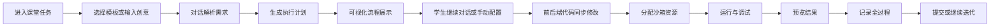
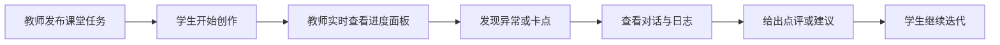

# 课堂 Vibe Coding 平台需求分析

## 1. 项目背景

目标是建设一个面向课堂教学的 Vibe Coding 平台，让学生围绕课程、主题、问题快速完成创意实现，而不是做工程化交付。平台需要支持：

- 通过自然语言与大模型对话完成需求表达、方案生成、代码修改与调试
- 通过可视化流程和手动配置完成同样的搭建过程
- 同时修改前端展示与轻量后端逻辑
- 在课堂规模下稳定运行，并保留全过程记录，支撑教学分析与用户画像

该平台的核心价值不是“产出生产级系统”，而是“降低学生表达与试错门槛，让课堂中的创意实现过程可见、可控、可复盘”。

## 2. 业务目标

### 2.1 教学目标

- 让学生在一节课内完成从想法到可运行原型的闭环
- 让教师能够定义课堂任务、观察学生过程并进行点评，首期不直接干预学生代码
- 让管理者能够统一管理课程、资源、权限、审计与运行成本

### 2.2 产品目标

- 提供“对话驱动 + 可视化驱动 + 手动编辑”三种协同方式
- 将构建流程可视化，帮助学生理解 AI 如何完成代码生成与修改
- 实现资源隔离，避免学生之间相互影响
- 保留对话、操作、代码变更、运行日志，作为画像和评估的基础数据

### 2.3 技术目标

- 支持课堂并发场景下的会话处理、代码生成、运行调试
- 支持多租户、多班级、多课程、多作业主题
- 支持后续扩展更多模板、Agent、分析能力和教学插件

## 3. 核心使用场景

### 3.1 学生场景

- 进入某门课程下的课堂任务
- 查看教师布置的主题、问题、约束、示例和评价维度
- 通过对话输入想法，例如“做一个校园二手书页面，加一个留言接口”
- 平台自动拆解为页面、组件、接口、数据模型、运行任务
- 学生可以通过节点式流程界面查看当前生成步骤
- 学生可以选择继续对话修改，也可以点击表单、开关、模板进行手动配置
- 学生可以自由输入超出题目边界的需求，系统根据能力画像和任务目标给出引导与风险提示
- 如果需求超出当前系统能力，平台需要明确告知“不支持原因、建议替代方案、推荐收敛路径”
- 平台同步更新前端和后端代码
- 学生无需自行安装额外依赖，使用平台预置好的统一运行环境
- 运行沙箱环境，展示预览、日志、错误、修复建议
- 提交结果、查看评分并保留过程记录

### 3.2 教师场景

- 创建课程、班级、课堂任务、主题与限制条件
- 配置可用技术栈、资源配额、敏感能力白名单
- 实时查看学生进度、异常率、资源占用、对话摘要和原始对话
- 对学生过程进行点评、回放和评分
- 首期以观察、分析、评分为主，不直接下发修复建议
- 可在课堂中动态调整资源配额
- 按课堂维度导出成果、行为数据和评价建议
- 选择优秀作品发布到公告区进行全平台展示

### 3.3 管理员场景

- 管理租户、学校、课程、用户、权限
- 管理模型能力、镜像模板、资源池、审计策略
- 监控平台运行状态、成本、并发、故障与安全事件
- 配置日志保留周期与画像策略

## 4. 角色与权限

| 角色 | 主要职责 | 核心权限 |
| --- | --- | --- |
| 学生 | 参与课堂任务、构建原型、调试和提交 | 创建个人工作区、调用 Agent、查看自己日志与作品 |
| 教师 | 布置任务、观察过程、点评结果 | 管理课程任务、查看班级进度、回放学生过程、导出分析 |
| 管理员 | 平台治理、资源管理、安全审计 | 管理全局配置、镜像模板、资源调度、审计和告警 |

### 4.1 教学组织模型

建议平台采用“课程 - 班级 / 课堂 - 主题 - 问题 - 学生项目”的层级组织，而不是“一节课只对应一个主题”：

- 主题用于聚合同类问题，降低教师端和学生端查找成本
- 一个主题下允许配置多个问题，便于课堂内按难度或方向分组
- 学生进入后先选择问题，再进入个人创作工作区
- 学生允许超出题目边界自由发挥，但系统应结合学生画像给出风险提示、能力提示和建议路线

## 5. 功能范围

## 5.1 课堂域

- 课程管理
- 班级管理
- 课堂任务发布
- 主题与问题管理
- 模板与约束配置
- 公告与优秀作品展示

## 5.2 创作域

- 对话式需求输入
- 可视化流程编排
- 手动配置面板
- 前端原型生成
- 轻量后端生成
- 代码编辑与版本快照
- 一键运行与调试
- 结果提交与成绩查看

## 5.3 过程域

- 对话记录
- 操作记录
- 代码变更记录
- 运行日志与报错记录
- 关键节点快照
- 过程回放
- 认知状态分析

## 5.4 管理域

- 资源配额管理
- 模型策略管理
- 模板与插件管理
- 风险控制
- 可观测性与告警

## 5.5 分析域

- 学生画像
- 学习行为分析
- 课堂热度与难点分析
- 任务完成质量评估
- 教师点评辅助

## 6. 关键产品形态

平台建议采用“三栏式工作台 + 全流程时间线”设计：

- 左侧：课堂任务上下文、模板、手动配置面板
- 中间：对话区、流程图区、代码生成状态
- 右侧：预览、日志、调试、资源状态
- 底部或侧边：全过程时间线与回放入口

这样既能保持学生操作简单，也能让教师和管理员看到完整过程。

## 7. 核心流程

### 7.1 学生创作主流程

### 7.2 教师观察与干预流程

## 8. 非功能需求

### 8.1 性能与并发

- 支持课堂级高并发，重点压力来自对话请求、代码生成、容器启动与运行调试
- 高峰期应避免每次操作都冷启动运行环境
- UI 需要流式反馈，避免学生长时间“无响应等待”

### 8.2 可扩展性

- 课程、主题、模板、Agent、模型能力均应插件化或配置化
- 后续可以扩展到更多语言、更多运行模板和更多课堂分析能力

### 8.3 安全与隔离

- 学生运行环境必须隔离
- 网络、文件系统、执行时间、资源配额需限制
- 管理端必须具备审计能力

### 8.4 可追溯性

- 所有对话、配置、代码变更、运行事件必须可关联到某次课堂任务
- 支持按学生、任务、班级、时间段检索和回放
- 历史数据需要长期保留，建议按学期或 4 个月周期归档迁移

### 8.5 教学分析

- 教师需要查看比“是否完成”更细的过程认知信息
- 平台应支撑过程评分与结果评分两条评价线
- 平台应支持优秀作品展示、结果访问和配置回放

## 9. 关键难点

### 9.1 多模态操作一致性

用户既可以通过对话修改，也可以通过点击配置修改。平台需要一个统一的“中间状态模型”，保证两种输入方式最终都落在同一份项目结构描述上，否则前后端会频繁失配。

### 9.2 前后端联动生成

如果学生修改页面字段、交互流程或数据结构，后端接口、Mock 数据、数据模型和预览逻辑都要同步更新，不能只停留在页面层。

### 9.3 资源调度成本

课堂场景往往是短时间集中并发，资源峰值明显。如果每个学生都独占完整环境，成本和启动时间都会很高。

### 9.4 流程流畅性

学生体验非常依赖“即时反馈”。即使底层多 Agent 或多容器编排复杂，界面层也必须保持连续状态反馈，例如：

- 当前在分析需求
- 当前在生成页面
- 当前在更新接口
- 当前在启动运行环境
- 当前在分析报错

## 10. 建议的需求边界

为了降低首期复杂度，建议首版只覆盖：

- Web 前端原型
- 轻量后端 API
- 单项目工作区
- 受控模板与受控依赖
- 班级内课堂任务场景
- 统一预装依赖的受控运行环境

暂不建议首期覆盖：

- 任意外部依赖安装
- 长时间后台任务
- 复杂数据库
- 全栈生产部署
- 多人实时协作编码

## 11. 首期 MVP 定义

### 必须有

- 课程 / 课堂 / 任务体系
- 主题 / 问题层级管理
- 学生工作台
- 对话式生成
- 可视化流程展示
- 手动配置面板
- 前后端联动代码更新
- 沙箱运行与预览
- 日志与报错展示
- 过程留痕
- 教师看板
- 学生提交与成绩查看
- 教师查看原始对话与过程分析
- 公告区与优秀作品展示

### 应该有

- 自动修复建议
- 画像分析与推荐建议
- 简单资源调度策略
- 认知过程可视化

### 可以后置

- 多 Agent 自定义编排
- 高级教师干预
- 跨课堂分析
- 智能评分
- 多人协作

## 12. 当前已确认的关键决策

1. 平台采用“课程 / 班级 / 课堂 - 主题 - 问题 - 学生项目”的层级组织，一个主题下允许多个问题
2. 学生允许自由发挥和自由输入需求，但平台必须对不支持能力给出清晰反馈
3. 学生不强制从教师模板开始，模板作为辅助而不是硬约束
4. 首期不开放额外依赖安装，统一使用预装 LangChain 与前端样式库的标准环境
5. 平台采用统一 Project Schema 作为前后端联动的单一事实源，不建议绕过 Schema 直接自由改源码
6. 首期运行底座采用 Docker 容器池，满足约 100 人课堂并发并预留后续演进到 Kubernetes 的能力
7. 教师首期以查看、分析、评分为主，不直接干预学生代码，不提供冻结学生工作区能力，但支持动态资源配额调整
8. 对话与行为日志长期保留，在线主库按 4 个月或学期周期归档迁移
9. 教师需要查看学生原始对话、过程分析、结果预览与评分结果
10. 首期不做多人协作，但需要支持优秀作品公告展示、结果访问与配置回放
11. 当前没有额外学校数据合规限制，首期不要求脱敏、分级授权或导出审批流程
12. 公告区默认只公开流水线配置视图与最终运行结果，不公开原始对话和其他过程数据
13. 学生项目技术栈首期固定统一，后期再考虑白名单切换与干预组限制能力
14. 优秀作品运行结果采用限时访问地址，可按教学需要延长有效期
15. 归档库与在线库之间的联动查询不进入首期范围
16. 评分采用教师评分 + 系统自动评分建议结合方式，自动评分可以异步生成，避免实时压力
17. 不同课程应支持不同评分权重与 Rubric 配置，由教师按课程自行设定
