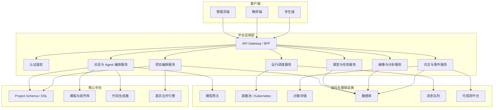
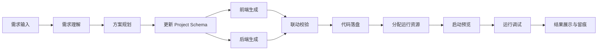
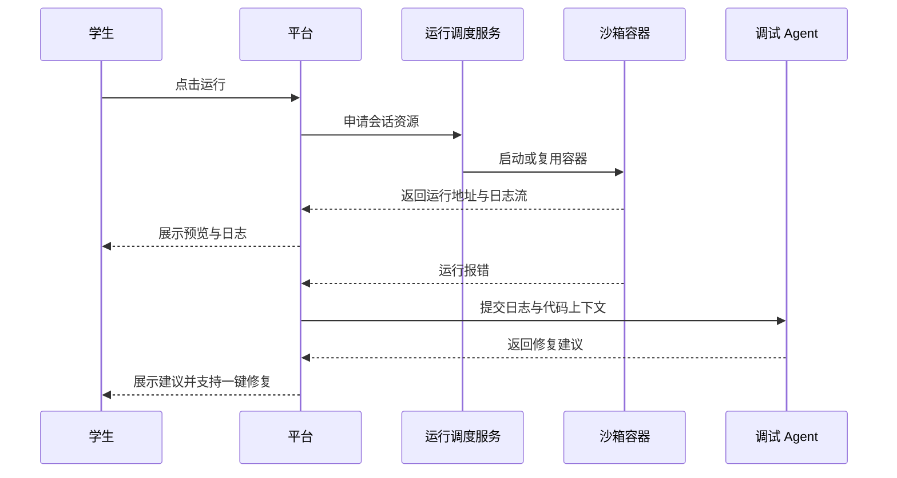

# 课堂 Vibe Coding 平台技术方案

## 1. 设计原则

- 教学优先：优先保障课堂流程完整、反馈及时、结果可解释
- 流程可视：所有 Agent、任务、代码和运行状态都可被学生和教师理解
- 双通道输入：对话驱动与手动配置驱动必须统一落盘
- 前后端联动：UI 配置变化必须传导到接口、数据模型和运行行为
- 资源隔离：每个学生会话具备独立执行边界
- 扩展友好：模板、Agent、模型、运行时、画像能力可插拔

## 2. 总体架构

## 3. 核心设计：统一 Project Schema

这是整个平台最关键的设计点。建议不要让“对话修改代码”和“点击配置改页面”直接操作源码，而是让两者都先作用在统一的 Project Schema 上，再由代码生成器和差异合并引擎落到代码仓。

### 3.1 Project Schema 建议包含

- 项目元信息：课程、任务、技术栈、模板
- 页面结构：页面、路由、组件树、布局
- 交互行为：按钮事件、表单提交、状态联动
- 数据模型：实体、字段、校验规则
- API 定义：接口路径、方法、请求响应结构
- 数据源策略：Mock、本地内存、轻量数据库
- 运行配置：端口、依赖白名单、环境变量占位

### 3.2 带来的价值

- 对话和可视化配置不会互相覆盖
- 可以生成流程图、配置面板和代码差异
- 方便做回放、审计、快照和画像
- 方便未来扩展更多模板和更多语言

### 3.3 边界约束

- 首期不建议绕过 Schema 直接自由编辑前后端源码
- 学生的自由度应体现在“表达想法”和“调整配置”，而不是“无限制改造工程结构”
- 如果需求无法映射到当前 Schema 能力，系统应明确告知约束并给出替代实现建议

## 4. 多 Agent 流水线设计

首期建议采用“固定流水线 + 节点状态可视化”，而不是一开始就做完全开放的 Agent 图编排。这样更适合课堂稳定性。

### 4.1 推荐 Agent 角色

| Agent | 作用 | 输出 |
| --- | --- | --- |
| 需求理解 Agent | 解析学生意图、识别功能点和限制 | 任务摘要、需求结构化结果 |
| 方案规划 Agent | 生成实现计划与步骤 | Project Plan、节点清单 |
| 前端生成 Agent | 生成页面、组件、样式 | 前端代码变更 |
| 后端生成 Agent | 生成 API、数据模型、Mock 或轻服务 | 后端代码变更 |
| 联动校验 Agent | 检查前后端字段、接口一致性 | 校验结果与修复建议 |
| 运行调试 Agent | 分析运行日志和错误 | 修复建议或补丁 |
| 教学总结 Agent | 提炼过程亮点、难点和学习行为 | 教师摘要、画像特征 |

### 4.2 流水线状态图

### 4.3 可视化建议

学生端界面中，流水线不应只显示“成功/失败”，而应展示：

- 当前节点名称
- 输入来源
- 节点耗时
- 当前生成了哪些文件
- 是否需要人工确认
- 出错原因与建议下一步

教师端则重点展示：

- 班级维度的节点分布
- 学生卡在哪一类节点
- 哪类任务最容易报错

### 4.4 为什么首期不开放自定义 Agent 编排

“前端点击图标自己配置”与“开放自定义 Agent 编排”不是一回事：

- 前者是在既定流水线内调整参数、节点开关、模板和任务配置
- 后者是允许重新定义 Agent 类型、执行顺序、工具调用、失败重试和协作关系

课堂首期更适合前者，因为：

- 教师和学生更容易理解
- 平台稳定性更高
- 调试和留痕更简单
- 不会把教学产品过早拉向复杂工作流平台

## 5. 双通道交互设计

## 5.1 对话驱动

适合学生自然表达：

- “帮我把首页改成深色科技风”
- “加一个留言提交接口”
- “点击卡片后跳到详情页”

流程：

1. 对话输入
2. LLM 结构化为意图
3. 映射为 Project Schema 变更
4. 生成代码差异
5. 执行、运行、展示反馈

## 5.2 手动配置驱动

适合教师控制边界和学生快速点击：

- 页面模板选择
- 配色主题切换
- 组件增删
- 字段表单配置
- API 表定义
- 数据模型配置

流程：

1. UI 面板修改
2. 转成同一套 Project Schema Patch
3. 生成代码差异
4. 执行、运行、展示反馈

## 5.3 自由输入与能力提示

- 学生允许自由输入任意想法
- 系统需要先判断“可直接完成、可降级完成、当前无法完成”三类状态
- 对于超出能力边界的请求，需要返回限制说明、推荐替代方案和最接近的可运行版本
- 推荐提示应结合历史画像、当前任务要求和常见错误模式生成

## 5.4 一致性机制

无论来自对话还是手动配置，都必须沉淀为：

- 一份 Schema 快照
- 一份变更事件
- 一份生成差异
- 一次运行记录

这样才能保证可追溯和回放。

## 6. 代码生成与落盘策略

## 6.1 推荐模式

采用“模板骨架 + Schema 驱动生成 + 局部 AST / Patch 修改”的混合模式。

### 原因

- 纯大模型自由生成，稳定性不足
- 纯模板拼接，灵活性不足
- 混合模式更适合课堂场景，既可控又有创造空间

## 6.2 代码目录建议

每个学生工作区建议固定目录结构：

- frontend/
- backend/
- schema/
- logs/
- snapshots/
- meta/

## 6.3 落盘机制

- 先更新 Schema
- 对目标文件生成 patch
- 做一致性校验
- 再写入工作区
- 自动生成快照

## 7. 运行与调试架构

## 7.1 运行单元建议

建议将“学生会话工作区”作为最小运行单元，每个工作区对应独立沙箱上下文。

### 可选实现路径

#### 方案 A：Docker 容器池

- 提前准备多种基础镜像
- 学生进入课堂时分配或复用一个 warm container
- 优点是实现快、运维简单、适合 MVP
- 缺点是更大规模弹性能力较弱

#### 方案 B：Kubernetes + Job / Pod

- 用 Pod 作为隔离边界
- 配合命名空间、配额、HPA、节点池
- 优点是治理能力强，适合中后期扩展
- 缺点是初期复杂度较高

#### 方案 C：Ray 作为任务编排补充

- 适合管理代码生成、日志分析、批量处理等计算任务
- 不建议把 Ray 作为首要的运行沙箱底座
- 更适合在后续做大规模异步 Agent 编排和分析任务

### 结论

首期推荐：

- 用户代码运行层使用 Docker 容器池
- 平台规模上来后迁移到 Kubernetes
- Ray 作为分析与异步任务框架按需补入

### 7.1.1 课堂规模下的判断

如果单次课程规模约为 100 人，且以轻量前后端原型为主：

- 首期不一定需要直接上 Kubernetes
- Docker 容器池配合资源预热、队列削峰和会话隔离，通常足以支撑 MVP
- 但沙箱隔离、资源配额、日志采集和工作区生命周期管理必须一开始就设计成可平台化迁移

### 7.1.2 建议的沙箱形态

- 每名学生对应一个独立 Web / API 沙箱会话
- 基础镜像预装 LangChain、常用 Python 包、统一前端组件库和常见工具链
- 通过挂载学生工作区目录与只读基础环境，降低冷启动和依赖安装等待
- 容器级限制 CPU、内存、网络访问、存活时长和并发运行数

### 7.1.3 Kubernetes 配置复杂度判断

如果问题是“Kubernetes 配起来麻烦吗”，答案是：

- 比 Docker 容器池明显更复杂
- 复杂点不在“把服务跑起来”，而在“把课堂场景稳定治理起来”
- 对首期 100 人课堂 MVP 来说，不是必须现在就上

Kubernetes 额外增加的复杂度主要来自：

- 集群安装与运维：控制面、节点、网络插件、存储类、Ingress、证书
- 资源治理：Namespace、Quota、LimitRange、HPA、节点池和调度策略
- 可观测与故障排查：日志、指标、事件、Pod 生命周期、镜像拉取失败等
- 安全隔离：ServiceAccount、RBAC、NetworkPolicy、镜像权限和密钥管理
- 发布与升级：镜像仓库、CI/CD、配置管理、回滚策略

如果团队当前主要目标是验证教学产品体验，而不是建设大规模平台底座，建议：

- 首期先用 Docker 容器池把产品流程跑顺
- 在服务边界、会话生命周期、资源配额、日志采集上按未来可迁移方式设计
- 当课堂规模、课程数和并发压力持续增长时，再迁移到 Kubernetes

## 7.2 调试链路

## 8. 高并发设计

课堂场景的并发特点是“短时集中爆发”。设计重点不是绝对极限吞吐，而是峰值期体验稳定。

## 8.1 压力来源

- 同一时间进入课堂
- 同一时间调用 LLM
- 同一时间启动运行环境
- 同一时间拉取预览与日志

## 8.2 缓解策略

### 请求层

- WebSocket / SSE 流式返回，减少长等待感
- 限流与排队机制，防止模型网关被击穿
- 对相同模板初始化做缓存

### 模型层

- 增加模型网关，统一做路由、重试、降级、熔断
- 区分高价值请求和低价值请求
- 长文本总结、画像计算使用异步任务

### 运行层

- 预热容器池，避免集中冷启动
- 采用基础镜像 + 工作区挂载的方式减少启动成本
- 空闲会话设置 TTL 自动回收

### 数据层

- 事件日志写入消息队列，异步落库
- 热点状态用 Redis 类缓存承接
- 快照和运行产物进入对象存储

### 8.3 容量与预热建议

按 100 人课堂并发目标，建议首期按以下思路设计：

- 以 100 并发作为保底容量，按 120 到 150 峰值突发做弹性预留
- 课前预热一批标准容器，避免上课前 1 到 3 分钟集中冷启动
- 将 LLM 请求、运行请求、日志分析请求拆分成不同队列
- 对学生端界面采用流式返回和分阶段完成提示，优先优化体感延迟

## 9. 过程留痕与画像设计

## 9.1 事件模型建议

所有行为统一抽象成事件流：

- SessionStarted
- PromptSubmitted
- SchemaPatched
- CodeGenerated
- RunRequested
- RunFailed
- RunRecovered
- TeacherReviewed
- ProjectSubmitted

每个事件都应带上：

- user_id
- class_id
- course_id
- assignment_id
- session_id
- timestamp
- actor_type
- payload_summary

## 9.2 留痕范围

- 对话内容
- 点击配置行为
- Schema 变更
- 代码 diff
- 运行日志
- 错误与修复过程
- 提交结果

## 9.3 画像与推荐方向

首期建议同时具备“分析特征”和“推荐建议”两类能力，但推荐不强制采用：

- 偏好哪类模板或任务方向
- 常见报错类型
- 平均迭代次数
- 对话依赖程度
- 手动配置比例
- 任务完成路径
- 常见求助方式

在此基础上，向学生提供可选建议：

- 推荐下一步操作
- 推荐更适合当前能力的收敛路径
- 推荐可复用组件或示例

后续再引入更复杂能力：

- 学习风格分类
- 能力成长轨迹
- 个性化推荐策略优化

## 9.4 教师认知分析与评分设计

教师端不应只看最终结果，还应看到过程层的认知信号。建议参考以下分析思路：

- 会话阶段分析：将过程划分为理解问题、方案规划、搭建实现、调试修复、总结提交
- 对话行为编码：标记提问、试错、求助、反思、复述需求、确认结果等行为
- 过程轨迹可视化：用时间线、状态转移图、热力图展示学生在各阶段停留和切换情况
- 错误演化分析：追踪从首次失败到成功修复的路径
- 帮助依赖分析：区分学生是高度依赖 AI、适度借助 AI，还是具备较高自主迭代能力

推荐首期采用“双评分”：

- 过程评分：看任务理解、迭代质量、调试能力、主动探索程度、收敛效率
- 结果评分：看功能完成度、界面表现、前后端一致性、运行稳定性、表达完整度

教师端可视化建议：

- 单学生认知轨迹时间线
- 班级阶段分布热力图
- 报错类型排行榜
- AI 依赖度分布图
- 过程分与结果分对照图

## 9.5 公告与优秀作品展示

平台应支持教师将优秀作品发布到公告区，展示内容建议包含：

- 限时有效的最终运行结果访问地址
- 项目截图或封面图
- 所用配置与流程摘要
- 关键 Agent 流程图
- 学生可公开的反思与亮点说明

公告区默认只公开：

- 流水线 / Agent 配置视图
- 最终运行结果页面

公告区默认不公开：

- 原始对话
- 全量日志
- 评分细节

## 10. 推荐技术栈

## 10.1 学生项目统一技术栈

- 前端：React + TypeScript + Vite
- UI 组件库：Ant Design
- 状态管理：Zustand
- 数据请求：TanStack Query + Axios
- 图表与可视化：ECharts
- 后端：Python FastAPI + Pydantic
- 数据存储：SQLite 或内存数据层
- AI 能力：LangChain 预装在基础镜像中

这样做的原因是：

- 组件成熟、样式丰富、适合快速出效果
- 前后端边界清晰，适合自动生成与联动校验
- 不需要学生等待临时安装依赖
- 对 100 人课堂运维更可控

## 10.2 平台前端

- Web：React + TypeScript
- 流程图：React Flow
- 编辑器：Monaco Editor
- 实时通信：WebSocket / SSE

## 10.3 平台后端

- API Gateway / BFF：NestJS
- 编排与 Agent 服务：Python FastAPI
- 运行调度服务：Python FastAPI
- 事件处理：Redis Stream 起步，后续可迁移 Kafka
- 缓存：Redis

## 10.4 数据与存储

- 主数据库：PostgreSQL
- 对象存储：S3 兼容存储
- 日志检索：ELK / OpenSearch
- 归档策略：主库保留近期热数据，按 4 个月或学期周期归档到历史库 / 冷存储
- 首期不强制实现归档库与在线库联动查询

## 10.5 基础设施

- 首期：Docker + Docker Compose / 自研调度层
- 中期：Kubernetes
- 观测：Prometheus + Grafana + Loki / OpenTelemetry

## 11. 分阶段实施建议

### 第一阶段：MVP

- 课程、课堂、任务体系
- 主题 / 问题分层管理
- 学生端工作台
- 对话式生成
- 固定流水线可视化
- 前后端基础联动
- Docker 容器池
- 教师实时看板
- 事件留痕
- 学生提交与成绩查看
- 教师原始对话查看与双评分
- 公告展示优秀作品

### 第二阶段：增强版

- 手动配置面板增强
- 快照回放
- 自动修复建议
- 教学模板库
- 更细粒度的资源调度
- 管理员治理面板
- 认知过程可视化增强
- 技术栈白名单切换
- 干预组 / 限制组能力

### 第三阶段：平台化

- Kubernetes 化
- 可插拔 Agent 编排
- 画像与推荐系统
- 更大规模课堂并发支撑
- 多学科扩展
- 多人协作能力

## 12. 关键技术决策建议

| 决策点 | 建议 |
| --- | --- |
| 对话与点击是否共用同一模型 | 是，统一映射到 Project Schema，且不建议绕过 Schema 自由改源码 |
| Agent 编排是否一开始开放 | 否，首期先固定流水线 |
| 运行底座是否直接上 K8s | 否，首期先容器池，预留迁移能力 |
| 是否记录所有中间过程 | 是，按事件流完整留痕 |
| 是否首期接入画像与推荐 | 是，先做分析特征和可选推荐，不做复杂自学习系统 |
| 教师是否直接干预学生代码 | 否，首期以查看、分析、评分为主 |
| 是否支持多人协作 | 否，首期先做个人创作与优秀作品公告展示 |
| 学生技术栈是否允许切换 | 首期固定统一，后续再开放白名单切换 |
| 优秀作品结果是否长期公开 | 否，使用可延长的限时访问地址 |
| 自动评分是否实时生成 | 否，建议异步定时生成，降低课堂高峰压力 |

## 13. 主要风险与应对

| 风险 | 描述 | 应对 |
| --- | --- | --- |
| 生成不稳定 | 大模型输出质量波动 | 用模板、Schema、校验器约束 |
| 并发抖动 | 上课瞬间请求峰值高 | 预热容器、队列削峰、异步化 |
| 前后端不一致 | UI 改了但接口没跟上 | 联动校验 Agent + Schema 单一事实源 |
| 成本失控 | 容器与模型调用过多 | 配额、限流、冷热分层 |
| 安全风险 | 学生代码执行不可控 | 沙箱隔离、网络限制、白名单依赖 |

## 14. 推荐结论

如果目标是先快速验证课堂价值，推荐采用以下首版路线：

1. 用统一 Project Schema 做中台
2. 用固定多 Agent 流水线做可视化生成
3. 用 Docker 容器池提供每名学生独立会话沙箱
4. 用事件流沉淀全过程数据
5. 用教师看板先解决课堂可观察性
6. 等课堂规模和需求稳定后，再迁移到 Kubernetes 并引入更复杂的调度和画像能力
