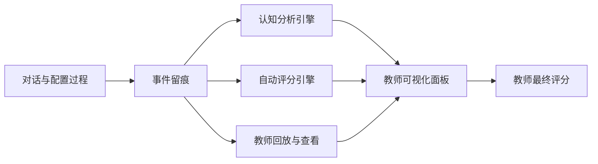

# 课堂 Vibe Coding 平台教师评分模型与认知分析可视化设计

## 1. 文档目标

本方案用于定义教师端如何基于学生的对话、配置、代码变更、运行调试与最终结果进行评价，并将过程中的认知状态以可视化方式呈现给教师。

本方案遵循以下原则：

- 结果与过程并重
- 教师评分与系统评分协同
- 分析与评分分离，避免课堂高峰实时压力过大
- 可解释优先，避免给出黑箱评分
- 课程可配置，支持不同 Rubric

## 2. 设计背景

项目式学习场景下，AI 的价值不只是提升完成效率，更重要的是把学生在探究、试错、调试和反思过程中的隐性认知轨迹外显出来。与传统只看最终作品的评价方式相比，这类平台更适合做过程性评价、个性化反馈和教学策略调整。

因此，教师端评分系统不应只回答“作品做没做出来”，而应同时回答：

- 学生是否理解了问题
- 学生是否形成了合理方案
- 学生是否能够进行有效试错与修复
- 学生是否过度依赖 AI 或具备一定自主迭代能力
- 最终结果是否达到课堂目标

## 3. 总体评价架构

建议采用“双评分 + 一分析层”的结构：

1. 教师评分
2. 系统自动评分建议
3. 认知分析可视化层

三者关系如下：



## 4. 评分模型总览

建议每个项目采用两条主线评分：

- 过程评分
- 结果评分

同时保留：

- 教师最终分
- 系统建议分
- 分项解释

### 4.1 推荐评分结构

```json
{
  "score": {
    "rubricId": "rubric_web_basic",
    "weights": {
      "process": 0.5,
      "result": 0.5
    },
    "teacherScore": {
      "process": 82,
      "result": 88,
      "final": 85
    },
    "autoScoreSuggestion": {
      "process": 79,
      "result": 86,
      "final": 82.5
    }
  }
}
```

### 4.2 可配置原则

- 不同课程可配置不同权重
- 不同问题可绑定不同 Rubric
- 系统建议分不直接覆盖教师评分
- 教师可以接受、调整或忽略系统建议

## 5. 过程评分设计

过程评分用于评价学生在完成任务过程中的理解、策略、试错和收敛质量。

### 5.1 推荐一级维度

| 维度 | 含义 | 说明 |
| --- | --- | --- |
| 问题理解 | 是否理解题意、目标和边界 | 看是否存在明显跑题、误解 |
| 方案规划 | 是否形成基本实现路径 | 看是否有较稳定的推进策略 |
| 迭代质量 | 是否能基于反馈持续改进 | 看修改是否有方向、有收敛 |
| 调试修复 | 是否能定位并解决错误 | 看日志利用和修复有效性 |
| 自主性 | 对 AI 的依赖是否合理 | 既不完全依赖，也不盲目拒绝 |
| 反思表达 | 是否能总结自己做了什么 | 看提交说明和关键决策表达 |

### 5.2 推荐二级指标

#### 问题理解

- 是否围绕教师问题展开
- 是否识别到题目中的关键数据对象
- 是否在超出边界时能被系统引导后收敛

#### 方案规划

- 是否形成页面、接口、数据结构的对应关系
- 是否存在明显跳跃式、无结构修改
- 是否能逐步构建而不是完全随机试错

#### 迭代质量

- 单次修改是否与上一次反馈相关
- 失败后是否出现有效调整
- 是否存在长期无效循环

#### 调试修复

- 是否查看并利用日志
- 是否对错误进行针对性修复
- 是否能从失败逐步走向成功

#### 自主性

- 是不是每一步都直接向 AI 索要最终答案
- 是否存在主动验证、主动调整、主动简化需求行为
- 是否能在 AI 建议之外形成个人决策

#### 反思表达

- 是否清晰说明实现内容
- 是否说明遇到的问题与解决方式
- 是否能解释关键设计取舍

## 6. 结果评分设计

结果评分用于评价最终交付物是否满足任务目标与展示质量。

### 6.1 推荐一级维度

| 维度 | 含义 |
| --- | --- |
| 功能完成度 | 是否完成主要功能 |
| 前后端一致性 | 页面、接口、数据结构是否匹配 |
| 可运行性 | 是否能正常启动、访问、操作 |
| 界面表现 | 视觉结构、交互完整度、展示质量 |
| 表达完整度 | 提交结果和说明是否完整 |

### 6.2 结果评分参考

- 功能完成度：核心页面和关键接口是否可用
- 前后端一致性：字段名、接口响应、组件绑定是否一致
- 可运行性：是否能稳定访问，不出现致命错误
- 界面表现：布局清晰、样式统一、操作直观
- 表达完整度：提交信息、截图、展示结果是否完整

## 7. 教师评分与系统评分协作方式

### 7.1 推荐流程

1. 学生提交结果
2. 系统异步生成自动评分建议
3. 教师查看过程回放、认知分析与系统建议
4. 教师录入最终评分与评语

### 7.2 为什么自动评分不做实时

- 课堂高峰期主要资源应优先给生成、运行与调试
- 自动评分可以在提交后异步处理，不影响学生创作体验
- 批量异步生成更利于控制成本与系统压力

### 7.3 教师端展示建议

教师端每个项目展示三部分：

- 教师最终分
- 系统建议分
- 分项解释与证据

例如：

```json
{
  "scoreEvidence": {
    "process": [
      "第 3 次运行失败后，学生查看日志并修改接口字段映射",
      "学生将超范围需求收敛为当前题目允许的版本"
    ],
    "result": [
      "首页、详情页、留言接口均可运行",
      "前端字段 title 与后端响应 title 一致"
    ]
  }
}
```

## 8. 认知分析框架

认知分析不是心理学诊断，而是对学习过程的结构化观察。

建议首期采用“阶段 + 行为 + 转移”的轻量框架。

### 8.1 阶段模型

将学生一次完整创作过程划分为五个阶段：

1. 理解问题
2. 方案规划
3. 搭建实现
4. 调试修复
5. 总结提交

### 8.2 行为编码

建议对关键行为做轻量标签：

| 行为标签 | 含义 |
| --- | --- |
| clarify | 澄清需求 |
| plan | 规划方案 |
| generate | 生成代码或配置 |
| inspect | 查看日志、快照、结果 |
| debug | 调试修复 |
| retry | 重试执行 |
| reflect | 反思总结 |
| diverge | 偏离题目边界 |
| converge | 收敛回题目目标 |

### 8.3 可计算指标

基于事件流可计算以下指标：

- 总迭代次数
- 有效迭代率
- 调试恢复率
- 阶段停留时长
- 阶段切换次数
- AI 依赖度
- 跑题后收敛次数
- 最终完成路径长度

## 9. 认知分析可视化设计

教师端建议做五类核心图。

## 9.1 学生认知轨迹时间线

目标：帮助教师理解单个学生从开始到提交的全过程。

展示内容：

- 阶段切换节点
- 关键对话摘要
- 关键 Schema 变更
- 运行成功 / 失败点
- 教师评分参考点

适用场景：

- 单人复盘
- 评分前审阅
- 个案指导

## 9.2 阶段分布热力图

目标：帮助教师理解整个班级在哪些阶段停留时间更长。

横轴建议：

- 理解问题
- 方案规划
- 搭建实现
- 调试修复
- 总结提交

纵轴建议：

- 学生列表或小组列表

解读价值：

- 快速看出班级普遍卡点
- 辅助教师判断当前应该做统一提醒还是个别指导

## 9.3 报错类型排行榜

目标：帮助教师看出班级中最常见的技术障碍。

统计维度建议：

- 前端运行错误
- 接口字段不一致
- 路由跳转错误
- 数据校验失败
- API 调用失败

解读价值：

- 识别课程内容难点
- 反向优化模板与提示

## 9.4 AI 依赖度分布图

目标：帮助教师理解学生在 AI 使用上的整体分布。

建议分档：

- 高依赖
- 中依赖
- 低依赖

说明：

- 高依赖不一定代表差，可能是任务难度高
- 该指标应作为辅助参考，不作为单一评分依据

## 9.5 过程分与结果分对照图

目标：识别“过程好但结果一般”或“结果好但过程薄弱”的学生。

应用价值：

- 帮助教师进行更细腻的评价
- 避免只看最终作品造成误判

## 10. 教师端页面建议

## 10.1 班级总览页

展示：

- 班级完成率
- 阶段热力图
- 报错排行榜
- AI 依赖度分布
- 平均过程分 / 结果分

## 10.2 学生详情页

展示：

- 基本信息
- 最终结果预览
- 流水线配置视图
- 原始对话入口
- 认知轨迹时间线
- 自动评分建议
- 教师评分表单

## 10.3 Rubric 配置页

展示：

- 课程 Rubric 列表
- 过程分 / 结果分权重
- 一级维度开关
- 分项说明模板
- 自动评分参与规则

## 11. Rubric 模型建议

建议将 Rubric 设计为课程级可配置对象。

```json
{
  "rubric": {
    "rubricId": "rubric_web_basic",
    "courseId": "course_web_01",
    "name": "Web 创意原型基础 Rubric",
    "weights": {
      "process": 0.4,
      "result": 0.6
    },
    "dimensions": [
      {
        "id": "problem_understanding",
        "group": "process",
        "weight": 0.15
      },
      {
        "id": "debug_recovery",
        "group": "process",
        "weight": 0.25
      },
      {
        "id": "function_completion",
        "group": "result",
        "weight": 0.35
      }
    ]
  }
}
```

### 配置建议

- 课程创建时可绑定默认 Rubric
- 教师可按具体主题覆盖权重
- 首期支持有限字段配置，不做过度自由化

## 12. 自动评分建议引擎

自动评分建议应聚焦“辅助教师”，而不是替代教师。

### 12.1 输入来源

- Project Schema 快照
- 事件时间线
- 运行日志摘要
- 对话摘要
- 最终运行结果检测

### 12.2 输出内容

- 过程分建议
- 结果分建议
- 关键证据点
- 风险提示

### 12.3 触发时机

- 学生点击提交后进入异步任务队列
- 课后批量重跑评分时可再次生成

## 13. 数据结构建议

```json
{
  "cognitionProfile": {
    "studentId": "student_001",
    "projectId": "project_stu_001",
    "stages": [
      {
        "name": "problem_understanding",
        "durationSeconds": 320
      },
      {
        "name": "debugging",
        "durationSeconds": 540
      }
    ],
    "metrics": {
      "iterationCount": 8,
      "successfulRuns": 2,
      "failedRuns": 3,
      "recoveryRate": 0.67,
      "aiDependencyLevel": "medium"
    },
    "flags": [
      "out_of_scope_then_converged",
      "used_logs_effectively"
    ]
  }
}
```

## 14. 风险与边界

### 14.1 不要把认知分析做成高风险判断

- 不输出带有心理诊断意味的标签
- 不做学生人格类型判断
- 不把 AI 依赖度等同于能力高低

### 14.2 不要让自动评分成为唯一依据

- 教师应始终保有最终决定权
- 系统评分必须附解释和证据
- 评分差异较大时要提醒教师复核

### 14.3 首期不过度追求复杂模型

- 首期先做规则 + 统计 + 结构化摘要
- 后续再考虑更复杂的画像与推荐模型

## 15. 首期 MVP 建议

首期教师评分与认知分析建议只做这些能力：

- 双评分结构
- 课程级 Rubric 配置
- 学生认知轨迹时间线
- 班级阶段热力图
- 报错排行榜
- AI 依赖度分布图
- 过程分与结果分对照图
- 原始对话查看入口
- 自动评分异步建议

## 16. 第二阶段建议

- Rubric 模板库
- 自动评分策略优化
- 认知行为标签扩充
- 班级对比分析
- 跨课堂趋势分析

## 17. 建议下一步

基于本方案，最适合继续输出的配套文档是：

- 教师端页面蓝图
- Rubric 配置字段字典
- 自动评分任务流设计
- 认知分析事件标签定义
