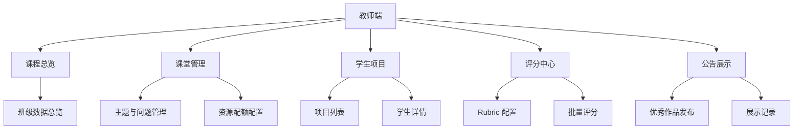

# 课堂 Vibe Coding 平台教师端页面蓝图

## 1. 文档目标

本蓝图用于定义教师端页面信息架构、页面职责、关键模块和核心交互流程，作为后续页面设计、前后端接口拆分和可视化实现的基础。

设计目标：

- 让教师快速掌握班级整体状态
- 让教师方便查看单个学生全过程
- 让教师高效完成评分与优秀作品发布
- 让教师通过认知分析更好理解学生学习过程

## 2. 教师端总体信息架构

建议教师端采用五个一级导航：

1. 课程总览
2. 课堂管理
3. 学生项目
4. 评分中心
5. 公告展示

## 3. 页面一：课程总览页

## 3.1 页面目标

帮助教师在最短时间内了解当前课程或当前课堂的整体运行状态。

## 3.2 页面结构

- 顶部：课程名称、课堂名称、主题 / 问题切换器、时间范围
- 第一屏：核心指标卡
- 第二屏：过程分析可视化
- 第三屏：异常与资源面板

## 3.3 核心指标卡

建议显示：

- 当前参与学生数
- 已提交人数
- 平均过程分
- 平均结果分
- 平均运行失败次数
- 当前资源占用率

## 3.4 过程分析区

建议放置：

- 班级阶段热力图
- 报错类型排行榜
- AI 依赖度分布图
- 过程分与结果分对照图

## 3.5 快捷操作

- 查看未提交学生
- 查看高风险学生
- 调整课堂资源配额
- 进入评分中心

## 4. 页面二：课堂管理页

## 4.1 页面目标

帮助教师配置本节课的主题、问题、资源和展示边界。

## 4.2 页面分区

- 主题管理区
- 问题管理区
- 约束配置区
- 资源配置区

## 4.3 主题管理区

字段建议：

- 主题名称
- 主题描述
- 主题排序
- 是否启用

## 4.4 问题管理区

字段建议：

- 问题标题
- 问题描述
- 评价维度摘要
- 绑定 Rubric
- 是否允许优秀作品展示

## 4.5 约束配置区

字段建议：

- 是否允许自由发挥
- 是否允许公告展示
- 使用的统一技术栈 profile
- 是否允许进入指定模板入口

## 4.6 资源配置区

字段建议：

- 单学生 CPU 配额
- 单学生内存配额
- 会话 TTL
- 课堂容器池保底数量

## 5. 页面三：学生项目列表页

## 5.1 页面目标

帮助教师在列表层面筛查项目状态、定位异常项目并进入详情页。

## 5.2 表格字段建议

| 字段 | 说明 |
| --- | --- |
| 学生姓名 | 学生标识 |
| 所属主题 / 问题 | 当前项目归属 |
| 项目标题 | 学生项目名称 |
| 当前阶段 | understanding / planning / building / debugging / submitted |
| 运行状态 | 正常 / 报错 / 未运行 |
| 过程分 | 教师分或暂存分 |
| 结果分 | 教师分或暂存分 |
| 自动评分建议 | 是否已生成 |
| AI 依赖度 | 高 / 中 / 低 |
| 最后更新时间 | 最近活跃时间 |

## 5.3 筛选条件建议

- 按主题筛选
- 按问题筛选
- 按项目状态筛选
- 按是否已提交筛选
- 按高风险项目筛选

## 5.4 批量操作建议

- 批量进入评分
- 批量导出分析数据
- 批量发布优秀作品

## 6. 页面四：学生详情页

## 6.1 页面目标

这是教师端最核心页面，用于完成单个学生的观察、理解、评分和发布决策。

## 6.2 页面布局建议

建议采用“四区布局”：

- 左侧：学生信息与项目概览
- 中间：认知轨迹与过程时间线
- 右侧：结果预览与流水线视图
- 底部：评分与评语区

## 6.3 左侧信息区

展示：

- 学生姓名 / 学号
- 主题 / 问题名称
- 项目标题
- 当前状态
- 提交时间
- 自动评分状态

## 6.4 中间过程区

展示：

- 学生认知轨迹时间线
- 阶段切换节点
- 关键对话摘要
- 关键 Schema Patch 摘要
- 运行失败与修复节点

支持操作：

- 展开查看原始对话
- 查看运行日志片段
- 查看关键代码变更摘要

## 6.5 右侧结果区

展示：

- 最终运行结果预览
- 流水线 / Agent 配置视图
- 关键页面截图
- 当前公开状态

支持操作：

- 打开结果页
- 查看公开内容范围
- 发布到公告区

## 6.6 底部评分区

展示：

- 过程分维度表单
- 结果分维度表单
- 自动评分建议
- 分项证据摘要
- 教师评语输入框

支持操作：

- 保存草稿评分
- 提交最终评分
- 使用系统建议初始化评分

## 7. 页面五：评分中心

## 7.1 页面目标

帮助教师进行批量评分和 Rubric 管理。

## 7.2 子页面一：评分任务页

展示：

- 未评分项目数
- 自动评分待生成数
- 已完成评分数
- 批量评分入口

列表字段建议：

- 学生
- 项目标题
- 自动评分状态
- 教师评分状态
- 最后更新时间

## 7.3 子页面二：Rubric 配置页

配置项建议：

- Rubric 名称
- 过程分权重
- 结果分权重
- 一级维度开关
- 各维度占比
- 自动评分参与比例

### Rubric 配置方式

- 支持课程默认 Rubric
- 支持问题级覆盖
- 支持复制现有 Rubric 另存

## 8. 页面六：公告展示页

## 8.1 页面目标

帮助教师挑选优秀作品并控制公开范围。

## 8.2 页面结构

- 待发布项目列表
- 已发布展示列表
- 发布配置抽屉

## 8.3 待发布项目列表字段

- 学生姓名
- 项目标题
- 主题 / 问题
- 教师最终分
- 是否已提交
- 自动评分完成状态

## 8.4 发布配置抽屉

字段建议：

- 是否发布
- 有效期截止时间
- 是否公开流水线视图
- 是否公开结果页
- 展示标题
- 展示摘要

### 首期约束

- 只允许公开流水线视图和结果页
- 不公开原始对话
- 不公开全量日志
- 不公开评分细节

## 9. 关键页面间流程

## 9.1 教师评分主流程

## 9.2 公告发布流程

## 10. 教师端核心组件清单

建议组件包括：

- 指标卡组件
- 阶段热力图组件
- 报错排行榜组件
- AI 依赖度分布组件
- 认知轨迹时间线组件
- 流水线视图组件
- 评分表单组件
- 公告发布配置抽屉

## 11. 教师端接口需求建议

需要的核心接口建议包括：

- 课程概览接口
- 课堂主题 / 问题配置接口
- 学生项目列表接口
- 学生详情接口
- 认知分析结果接口
- 自动评分建议接口
- 教师评分提交接口
- 公告发布接口

## 12. 首期优先实现页面

如果按 MVP 优先级排序，建议先做：

1. 课程总览页
2. 学生项目列表页
3. 学生详情页
4. Rubric 配置页
5. 公告发布页

## 13. 第二阶段增强页面

- 评分任务批量处理页
- 班级对比分析页
- 跨课堂趋势页
- 自动评分回看页

## 14. 建议下一步

基于本蓝图，下一步最适合继续补充：

- 教师端页面字段清单
- 教师端接口契约
- 前端组件树草图
- 页面与认知分析图表映射表
