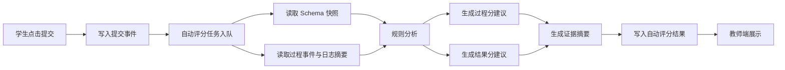

# 课堂 Vibe Coding 平台自动评分任务流设计

## 1. 文档目标

本方案用于定义学生提交后系统如何异步生成自动评分建议，包括任务触发、数据输入、计算流程、结果产出、失败处理与教师消费方式。

设计目标：

- 不影响课堂高峰期创作体验
- 为教师提供可解释的评分建议
- 与认知分析结果共享数据基础
- 支持课后批量重跑

## 2. 设计原则

- 异步优先，不走实时同步评分
- 结构化证据优先，不只输出分数
- 与教师最终评分解耦
- 可批量、可重试、可回放
- 可按课程 Rubric 配置

## 3. 总体任务流



## 4. 触发机制

## 4.1 主触发

- 学生点击提交按钮时触发
- 平台写入 `ProjectSubmitted` 事件
- 评分任务进入异步队列

## 4.2 补充触发

- 教师手动重算评分建议
- 课程 Rubric 更新后批量重算
- 平台升级评分规则后批量重算

## 4.3 不建议的触发方式

- 每次运行后都实时评分
- 每次对话后都评分
- 每次 Schema Patch 后都评分

原因：

- 资源开销过大
- 课堂高峰期压力不稳定
- 评分意义不足，噪声太大

## 5. 输入数据

自动评分建议引擎建议输入五类数据。

## 5.1 项目结构输入

来源：

- 最新 Project Schema 快照
- 最终提交通知时绑定的 Schema 版本

用途：

- 判断页面、组件、接口、数据模型是否完整
- 判断前后端是否一致

## 5.2 过程事件输入

来源：

- 对话摘要事件
- Schema Patch 事件
- 运行开始 / 失败 / 成功事件
- Agent 执行记录

用途：

- 计算迭代次数
- 计算调试恢复率
- 识别阶段停留与阶段切换

## 5.3 运行结果输入

来源：

- 最终运行日志摘要
- 预览检测结果
- 最终页面访问状态

用途：

- 判断项目可运行性
- 判断最终结果稳定性

## 5.4 课程配置输入

来源：

- 课程 Rubric
- 问题级评分覆盖配置

用途：

- 确定过程分 / 结果分权重
- 确定分项维度占比

## 5.5 展示结果输入

来源：

- 提交结果页快照
- 公告发布候选信息

用途：

- 评估表达完整度
- 为教师提供可视证据

## 6. 任务阶段拆分

建议将自动评分任务拆成四个阶段。

## 6.1 阶段一：数据汇聚

职责：

- 加载提交时的 Schema 快照
- 加载过程事件摘要
- 加载运行状态与结果检测
- 加载 Rubric

输出：

- 评分输入上下文对象

## 6.2 阶段二：过程评分计算

职责：

- 计算过程性指标
- 根据 Rubric 生成过程分建议

示例指标：

- iterationCount
- failedRuns
- recoveryRate
- aiDependencyLevel
- outOfScopeThenConverged

输出：

- 过程分建议
- 过程证据点

## 6.3 阶段三：结果评分计算

职责：

- 检查功能完成度
- 检查前后端一致性
- 检查最终结果可运行性
- 计算结果分建议

输出：

- 结果分建议
- 结果证据点

## 6.4 阶段四：结果写回

职责：

- 保存自动评分结果
- 写入生成时间
- 更新教师端可见状态

输出：

- 自动评分建议记录

## 7. 自动评分输出结构

```json
{
  "autoScoreResult": {
    "projectId": "project_stu_001",
    "rubricId": "rubric_web_basic",
    "processScore": 79,
    "resultScore": 86,
    "finalScore": 82.5,
    "evidence": {
      "process": [
        "学生共进行 8 次迭代，其中 2 次为关键调试收敛",
        "存在一次超范围需求，但后续收敛回题目目标"
      ],
      "result": [
        "首页与详情页均可访问",
        "留言接口请求与响应结构一致"
      ]
    },
    "riskFlags": [
      "high_ai_dependency"
    ],
    "generatedAt": "2026-03-30T11:00:00Z",
    "status": "ready"
  }
}
```

## 8. 过程评分计算建议

## 8.1 核心规则

可先采用“规则 + 统计”的轻量方案。

示例：

- 迭代次数过低且结果未完成，降低过程分
- 出现多次失败后成功修复，提高调试维度分
- 长时间停留在无效重试，降低迭代质量分
- 存在跑题后成功收敛，可保留一定探索加分

## 8.2 建议过程指标

| 指标 | 含义 |
| --- | --- |
| iterationCount | 总迭代次数 |
| successfulRuns | 成功运行次数 |
| failedRuns | 失败运行次数 |
| recoveryRate | 失败后恢复率 |
| aiDependencyLevel | AI 依赖等级 |
| divergenceCount | 跑题次数 |
| convergenceCount | 收敛次数 |

## 9. 结果评分计算建议

## 9.1 核心检查项

- 是否能启动前端
- 是否能启动后端
- 核心页面是否可访问
- 核心接口是否响应正常
- 前后端字段是否一致
- 页面结构是否基本完整

## 9.2 结果评分逻辑建议

- 可运行性是基础门槛
- 功能完成度按问题目标分项检查
- 前后端一致性单独计分，避免只看页面表现
- 表达完整度来自提交摘要、截图和结果说明

## 10. 异步队列设计

## 10.1 队列划分建议

建议将自动评分与课堂实时任务拆开：

- 实时生成队列
- 运行调试队列
- 自动评分队列
- 课后批处理队列

## 10.2 调度优先级建议

- 课堂实时生成最高
- 运行调试次高
- 自动评分中优先级
- 课后批处理最低

## 10.3 重试策略建议

- 首次失败后延迟重试
- 最多重试 3 次
- 连续失败后标记为 `failed`
- 教师端显示“自动评分暂不可用”

## 11. 状态机设计

建议自动评分任务使用显式状态机。

状态建议：

- pending
- collecting
- scoring_process
- scoring_result
- summarizing
- ready
- failed

## 12. 教师端消费方式

自动评分结果不直接覆盖教师评分，而是在教师端作为建议展示。

教师端建议显示：

- 系统建议过程分
- 系统建议结果分
- 关键证据摘要
- 风险提示
- 与教师当前分数差异

## 13. 差异提醒机制

当系统建议与教师评分差异较大时，建议提示教师复核。

### 建议阈值

- 过程分差异超过 15 分
- 结果分差异超过 15 分
- 最终分差异超过 10 分

提示形式建议：

- 黄色提醒条
- 可展开的证据列表
- 一键对比教师分与系统分

## 14. 数据表建议

建议至少有以下记录对象：

- auto_score_task
- auto_score_result
- auto_score_evidence
- rubric_profile

### auto_score_task 关键字段

- task_id
- project_id
- trigger_source
- status
- retry_count
- created_at
- finished_at

### auto_score_result 关键字段

- project_id
- rubric_id
- process_score
- result_score
- final_score
- risk_flags
- generated_at

## 15. 失败场景与降级方案

### 15.1 数据不完整

处理方式：

- 标记部分维度无法计算
- 输出“不完整评分建议”
- 提醒教师以人工评分为准

### 15.2 最终结果无法访问

处理方式：

- 可运行性维度降分
- 记录失败证据
- 不阻塞其他维度计算

### 15.3 任务队列积压

处理方式：

- 课中只记录待处理状态
- 课后批量完成
- 教师端展示“评分建议稍后生成”

## 16. 与认知分析共享部分

自动评分和认知分析应共享：

- 事件流摘要
- 阶段划分结果
- 调试恢复统计
- AI 依赖度判断

这样可以避免重复计算和重复存储。

## 17. 首期 MVP 范围

首期建议只实现：

- 提交后异步评分任务
- 课程 Rubric 加载
- 过程分建议
- 结果分建议
- 证据摘要生成
- 教师端展示建议分
- 失败重试与状态展示

## 18. 第二阶段增强

- 批量重算评分
- 课程间评分策略差异分析
- 自动评分规则在线调参
- 评分证据可视化增强
- 自动评分质量评估

## 19. 建议下一步

基于本方案，最适合继续补充：

- 自动评分任务字段字典
- 评分规则表
- 事件到指标映射表
- 教师端评分差异提示交互稿
