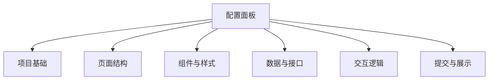

# 课堂 Vibe Coding 平台前端配置面板与 Schema 字段映射表

## 1. 文档目标

本文件用于说明学生端可视化配置面板如何映射到 Project Schema 字段，确保：

- 点击配置与对话生成共用同一事实源
- 前端配置可直接落为 Schema Patch
- 后续代码生成器与校验器可基于统一字段工作

## 2. 设计原则

- 面板只暴露首期受控能力
- 每个配置项都能映射到明确字段路径
- 每次配置变更都生成结构化 Patch
- UI 展示名与 Schema 路径分离

## 3. 面板总体结构

建议学生端配置面板分为六个一级分组：

1. 项目基础
2. 页面结构
3. 组件与样式
4. 数据与接口
5. 交互逻辑
6. 提交与展示



## 4. 项目基础分组

| 面板项 | 组件类型 | Schema 路径 | 说明 |
| --- | --- | --- | --- |
| 项目标题 | 输入框 | project.title | 修改项目名称 |
| 项目描述 | 多行输入框 | project.description | 修改项目说明 |
| 技术栈 Profile | 只读选择器 | project.techStackProfile | 首期只展示，不允许自由切换 |
| 可见性 | 单选 | project.visibility | 私有 / 班级可见 / 公告展示 |

### Patch 示例

```json
{
  "source": "manual_config",
  "operations": [
    {
      "op": "replace",
      "path": "/project/title",
      "value": "校园二手书交换站"
    }
  ]
}
```

## 5. 页面结构分组

## 5.1 页面管理

| 面板项 | 组件类型 | Schema 路径 | 说明 |
| --- | --- | --- | --- |
| 页面列表 | 列表管理器 | ui.pages | 管理页面集合 |
| 新增页面 | 按钮 + 表单 | ui.pages[] | 增加页面对象 |
| 页面名称 | 输入框 | ui.pages[].name | 修改页面名称 |
| 页面布局 | 下拉选择 | ui.pages[].layout | 选择受控布局 |

## 5.2 路由管理

| 面板项 | 组件类型 | Schema 路径 | 说明 |
| --- | --- | --- | --- |
| 路由路径 | 输入框 | ui.routes[].path | 修改页面访问路径 |
| 绑定页面 | 下拉选择 | ui.routes[].pageId | 将路由绑定到页面 |

### 页面新增 Patch 示例

```json
{
  "source": "manual_config",
  "operations": [
    {
      "op": "add",
      "path": "/ui/pages/-",
      "value": {
        "id": "page_detail",
        "name": "详情页",
        "layout": "default",
        "components": []
      }
    }
  ]
}
```

## 6. 组件与样式分组

## 6.1 组件树编辑

| 面板项 | 组件类型 | Schema 路径 | 说明 |
| --- | --- | --- | --- |
| 组件列表 | 树形编辑器 | ui.componentTree | 展示组件树 |
| 新增组件 | 组件面板 | ui.componentTree[] | 增加根组件或子组件 |
| 组件类型 | 下拉选择 | ui.componentTree[].type | 选择 Card / List / Form 等 |
| 组件属性 | 动态表单 | ui.componentTree[].props | 编辑受控属性 |
| 子组件顺序 | 拖拽排序 | ui.componentTree[].children | 调整层级与顺序 |

## 6.2 样式配置

| 面板项 | 组件类型 | Schema 路径 | 说明 |
| --- | --- | --- | --- |
| 主题预设 | 下拉选择 | ui.theme.preset | 切换主题方案 |
| 主色 | 颜色选择器 | ui.theme.primaryColor | 修改主色 |
| 圆角等级 | 下拉选择 | ui.theme.borderRadius | small / medium / large |

### 组件属性映射建议

| 组件类型 | 面板字段 | Schema 子路径 |
| --- | --- | --- |
| List | 数据源 | props.dataSource |
| List | 卡片样式 | props.cardStyle |
| Card | 标题字段 | props.titleField |
| Card | 副标题字段 | props.subtitleField |
| Form | 提交文案 | props.submitText |
| Button | 按钮文案 | props.label |

## 7. 数据与接口分组

## 7.1 数据实体面板

| 面板项 | 组件类型 | Schema 路径 | 说明 |
| --- | --- | --- | --- |
| 实体列表 | 列表 | data.entities | 管理数据实体 |
| 新增实体 | 按钮 + 抽屉 | data.entities[] | 添加新实体 |
| 字段名称 | 输入框 | data.entities[].fields[].name | 字段标识 |
| 字段类型 | 下拉选择 | data.entities[].fields[].type | string / number 等 |
| 是否必填 | 开关 | data.entities[].fields[].required | 必填约束 |

## 7.2 接口面板

| 面板项 | 组件类型 | Schema 路径 | 说明 |
| --- | --- | --- | --- |
| 接口列表 | 列表 | api.endpoints | 管理接口集合 |
| 请求方法 | 下拉选择 | api.endpoints[].method | GET / POST 等 |
| 接口路径 | 输入框 | api.endpoints[].path | 接口地址 |
| 响应绑定实体 | 下拉选择 | api.endpoints[].responseRef | 绑定数据实体 |
| 查询绑定 | 下拉选择 | api.queries[].bindTo | 绑定组件 |

### 新增字段 Patch 示例

```json
{
  "source": "manual_config",
  "operations": [
    {
      "op": "add",
      "path": "/data/entities/0/fields/-",
      "value": {
        "name": "ownerName",
        "type": "string",
        "required": true
      }
    }
  ]
}
```

## 8. 交互逻辑分组

## 8.1 事件面板

| 面板项 | 组件类型 | Schema 路径 | 说明 |
| --- | --- | --- | --- |
| 事件列表 | 列表 | logic.events | 管理交互事件 |
| 触发组件 | 下拉选择 | logic.events[].trigger.componentId | 来源组件 |
| 触发事件 | 下拉选择 | logic.events[].trigger.eventName | onClick / onSubmit |
| 动作类型 | 下拉选择 | logic.events[].actions[].type | navigate / callMutation 等 |
| 目标对象 | 选择器 | logic.events[].actions[].target | 目标路径或对象 id |

## 8.2 状态面板

| 面板项 | 组件类型 | Schema 路径 | 说明 |
| --- | --- | --- | --- |
| 状态仓列表 | 列表 | logic.stateStores | 管理状态仓 |
| 状态字段名 | 输入框 | logic.stateStores[].fields[].name | 字段名 |
| 默认值 | 输入框 / 开关 | logic.stateStores[].fields[].defaultValue | 默认状态值 |

## 9. 提交与展示分组

| 面板项 | 组件类型 | Schema 路径 | 说明 |
| --- | --- | --- | --- |
| 是否发布公告 | 开关 | submission.showcase.published | 控制是否进入候选发布状态 |
| 公开范围 | 多选 | submission.showcase.publicFields | 首期仅 pipeline_view / result_page |
| 访问截止时间 | 日期时间选择器 | submission.showcase.accessPolicy.expiresAt | 设置限时访问 |

## 10. 面板项与权限关系

## 10.1 学生可编辑

- project.title
- project.description
- ui.*
- logic.*
- data.*
- api.*

## 10.2 教师配置下发后只读

- context.*
- project.techStackProfile
- runtime.profile
- runtime.dependencyPolicy.installAllowed

## 10.3 学生不可编辑

- runtime.resourceQuota
- context.teacherConstraints.allowDependencyInstall
- submission.teacherScore
- submission.autoScore

## 11. 面板交互规则

### 11.1 实时落盘规则

- 小范围字段编辑可即时生成 Patch
- 复杂结构编辑可在点击“应用”后批量生成 Patch

### 11.2 校验规则

- 提交前做本地预校验
- 提交后由服务端做强校验
- 校验失败时显示字段级错误与推荐修复

### 11.3 同步规则

- 对话生成后，面板应自动刷新最新 Schema
- 面板修改后，对话区应显示“已应用某项配置变更”
- 当对话与面板同时改动同一路径时，以最新 Patch 时间戳为准

## 12. 建议的前端组件形态

建议配置面板采用：

- 左侧分组导航
- 中间配置表单区
- 右侧 Schema 变更预览区

右侧建议展示：

- 当前变更字段
- 生成的 Patch 摘要
- 影响的页面 / 接口 / 数据模型

## 13. 典型场景映射

## 13.1 学生修改首页主题色

- 面板操作：颜色选择器修改主色
- Schema 路径：`/ui/theme/primaryColor`
- Patch 类型：replace
- 影响范围：前端主题样式

## 13.2 学生增加留言接口

- 面板操作：新增接口 + 新增表单提交事件
- Schema 路径：
  - `/api/endpoints/-`
  - `/api/mutations/-`
  - `/logic/events/-`
- Patch 类型：add
- 影响范围：前端表单、后端接口、联动校验

## 13.3 学生新增详情页

- 面板操作：新增页面 + 新增路由 + 配置卡片点击跳转
- Schema 路径：
  - `/ui/pages/-`
  - `/ui/routes/-`
  - `/logic/events/-`
- 影响范围：页面结构、路由、交互逻辑

## 14. 首期不建议放进面板的能力

- 任意源码编辑
- 任意 npm / pip 包安装
- 自定义运行命令
- 自定义 Agent 图编排
- 外部服务密钥管理

## 15. 建议下一步

基于本映射表，下一步最适合继续补充：

- 配置面板字段清单
- 配置面板组件原型
- Schema Patch 操作规范
- 面板校验与错误提示规范
