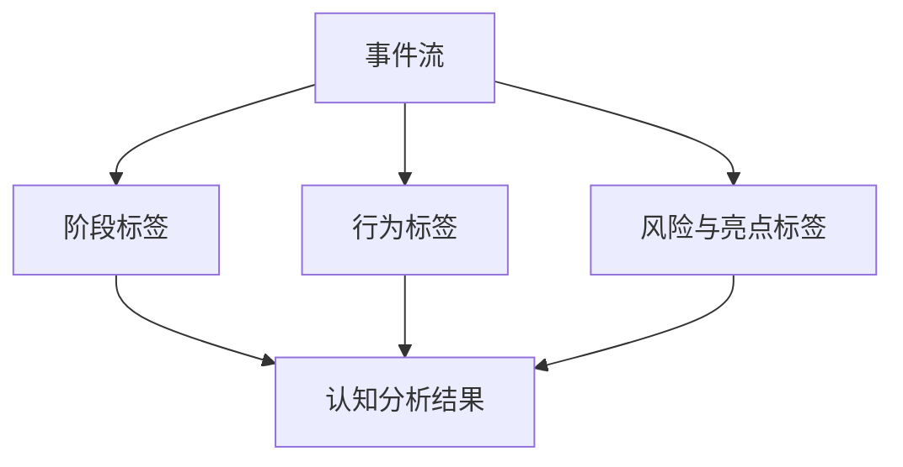

# 课堂 Vibe Coding 平台认知分析事件标签定义

## 1. 文档目标

本文件用于定义认知分析所需的事件标签体系，作为以下能力的统一基础：

- 学生认知轨迹时间线
- 班级阶段热力图
- AI 依赖度判断
- 过程评分指标提取
- 自动评分建议证据生成

## 2. 设计原则

- 标签表达学习行为，不表达人格判断
- 标签可由事件流稳定推导
- 标签要兼顾教师可理解性与系统可计算性
- 首期使用有限标签集，避免过度细化

## 3. 标签体系总览

建议采用三层结构：

1. 阶段标签
2. 行为标签
3. 风险 / 亮点标签



## 4. 阶段标签定义

阶段标签用于描述学生当前处于哪一类学习环节。

| 标签 | 含义 | 判定依据示例 |
| --- | --- | --- |
| understanding | 理解问题 | 阅读题目、澄清需求、确认任务目标 |
| planning | 方案规划 | 拆解页面、接口、数据模型、生成计划 |
| building | 搭建实现 | 连续新增页面、组件、接口、Schema Patch |
| debugging | 调试修复 | 查看日志、处理报错、重复运行修复 |
| reviewing | 结果检查 | 回看预览、核对功能、准备提交 |
| submitted | 完成提交 | 点击提交并进入评分环节 |

### 阶段切换建议

- 阶段切换应允许回退
- 一次会话中可以多次进入 debugging
- 阶段以时间段聚合，而不是只记录单个瞬时点

## 5. 行为标签定义

行为标签用于刻画学生在某个阶段具体做了什么。

## 5.1 理解与规划类

| 标签 | 含义 | 典型来源 |
| --- | --- | --- |
| clarify | 澄清需求 | 对话中确认题意、目标或限制 |
| restate_goal | 复述目标 | 对话中重新表述自己要做什么 |
| identify_entity | 识别实体 | 明确书籍、留言、用户等数据对象 |
| plan | 制定方案 | 生成实现步骤、分解页面与接口 |
| choose_template | 选择模板 | 通过点击或对话确定模板方向 |

## 5.2 搭建实现类

| 标签 | 含义 | 典型来源 |
| --- | --- | --- |
| generate_page | 新增页面 | 新增 ui.pages / ui.routes |
| configure_component | 配置组件 | 修改 ui.componentTree / props |
| add_api | 新增接口 | 新增 api.endpoints |
| update_data_model | 调整数据结构 | 修改 data.entities |
| bind_query | 绑定查询 | 新增 api.queries 或组件数据源 |

## 5.3 调试修复类

| 标签 | 含义 | 典型来源 |
| --- | --- | --- |
| inspect_log | 查看日志 | 打开日志面板、请求错误摘要 |
| inspect_preview | 查看预览 | 预览页查看和结果核对 |
| locate_error | 定位问题 | 对话或操作指向错误原因 |
| apply_fix | 应用修复 | 针对问题产生 Patch |
| retry_run | 重试运行 | 点击再次运行 |
| validate_fix | 验证修复 | 修复后再次检查结果 |

## 5.4 反思与提交类

| 标签 | 含义 | 典型来源 |
| --- | --- | --- |
| summarize_result | 总结结果 | 提交前填写说明 |
| reflect_problem | 反思问题 | 说明自己遇到的困难 |
| compare_versions | 对比版本 | 回看快照、回放流程 |
| submit_project | 提交项目 | 点击提交 |

## 6. 风险标签定义

风险标签用于帮助教师快速定位需要关注的情况。

| 标签 | 含义 | 说明 |
| --- | --- | --- |
| out_of_scope | 超题目边界 | 需求偏离教师问题范围 |
| repeated_failure | 连续失败 | 多次运行失败且无有效修复 |
| idle_stall | 长时间停滞 | 长时间无有效推进 |
| high_ai_dependency | AI 依赖高 | 多步完全依赖模型直接给答案 |
| weak_convergence | 收敛较弱 | 多轮修改后仍缺少明确方向 |

### 风险标签注意事项

- 风险标签用于教师提示，不直接等同于低能力
- 不应作为单一评分依据
- 应支持教师手动忽略或备注

## 7. 亮点标签定义

亮点标签用于帮助教师发现学生过程中的积极表现。

| 标签 | 含义 | 说明 |
| --- | --- | --- |
| effective_debugging | 调试有效 | 能根据日志完成针对性修复 |
| autonomous_iteration | 自主迭代较强 | 不完全依赖 AI，有明确自我调整 |
| fast_convergence | 收敛快 | 在较少迭代内完成目标 |
| good_structure | 结构规划清晰 | 页面、接口、数据模型关系明确 |
| reflective_summary | 反思清晰 | 提交说明能表达问题与解决过程 |

## 8. 标签来源映射

## 8.1 对话事件来源

对话可用于识别：

- clarify
- restate_goal
- plan
- reflect_problem
- summarize_result
- out_of_scope

## 8.2 Schema Patch 来源

Schema Patch 可用于识别：

- generate_page
- configure_component
- add_api
- update_data_model
- bind_query
- apply_fix

## 8.3 运行与日志来源

运行事件可用于识别：

- retry_run
- inspect_log
- locate_error
- validate_fix
- repeated_failure
- effective_debugging

## 8.4 提交流程来源

提交相关事件可用于识别：

- compare_versions
- submit_project
- reflective_summary

## 9. 标签到指标映射建议

| 指标 | 依赖标签 |
| --- | --- |
| iterationCount | generate_page / configure_component / add_api / apply_fix |
| recoveryRate | repeated_failure / apply_fix / validate_fix |
| aiDependencyLevel | plan / apply_fix / autonomous_iteration / high_ai_dependency |
| divergenceCount | out_of_scope |
| convergenceCount | fast_convergence / weak_convergence |

## 10. 标签判定规则建议

首期建议采用“规则 + 阈值”方式判定。

## 10.1 out_of_scope

可判定条件：

- 对话摘要明显偏离当前 questionTitle
- 新增页面或接口与题目核心对象长期无关

## 10.2 high_ai_dependency

可判定条件：

- 大量连续对话请求直接索要完整结果
- 缺少 inspect / validate / reflect 行为

## 10.3 effective_debugging

可判定条件：

- 先出现 inspect_log
- 后出现 apply_fix
- 再出现 validate_fix 或运行成功

## 10.4 idle_stall

可判定条件：

- 在较长时间窗口内无有效 Patch、无运行、无阶段推进

## 11. 时间线展示建议

教师端时间线建议按以下格式展示：

- 时间点
- 阶段标签
- 行为标签
- 摘要文本
- 证据入口

### 示例

```json
{
  "timestamp": "2026-03-30T10:18:00Z",
  "stage": "debugging",
  "behaviors": [
    "inspect_log",
    "locate_error"
  ],
  "summary": "学生查看运行日志并定位到接口字段不一致",
  "evidenceRef": [
    "run_log_002",
    "patch_005"
  ]
}
```

## 12. 班级聚合分析建议

标签除了用于单人分析，还可以做班级聚合。

### 12.1 常见聚合项

- 哪类标签最常出现
- 哪一阶段停留最久
- 哪类风险标签分布最多
- 哪类亮点标签最常见

### 12.2 教师价值

- 识别课程设计薄弱点
- 识别需要统一讲解的技术问题
- 识别优秀学生的共同行为模式

## 13. 首期标签集建议

为控制复杂度，首期建议只上线以下标签：

### 阶段标签

- understanding
- planning
- building
- debugging
- reviewing
- submitted

### 行为标签

- clarify
- plan
- generate_page
- configure_component
- add_api
- inspect_log
- apply_fix
- retry_run
- summarize_result
- submit_project

### 风险与亮点标签

- out_of_scope
- repeated_failure
- high_ai_dependency
- effective_debugging
- autonomous_iteration

## 14. 第二阶段可扩展标签

- identify_entity
- bind_query
- update_data_model
- validate_fix
- compare_versions
- fast_convergence
- weak_convergence
- reflective_summary

## 15. 不建议定义的标签

首期不建议定义：

- 人格型标签
- 情绪诊断型标签
- 智力高低判断标签
- 无法从事件流稳定推导的主观标签

## 16. 建议下一步

基于本文件，下一步最适合继续补充：

- 事件到标签映射规则表
- 标签到评分维度映射表
- 认知时间线接口契约
- 班级聚合分析指标定义
