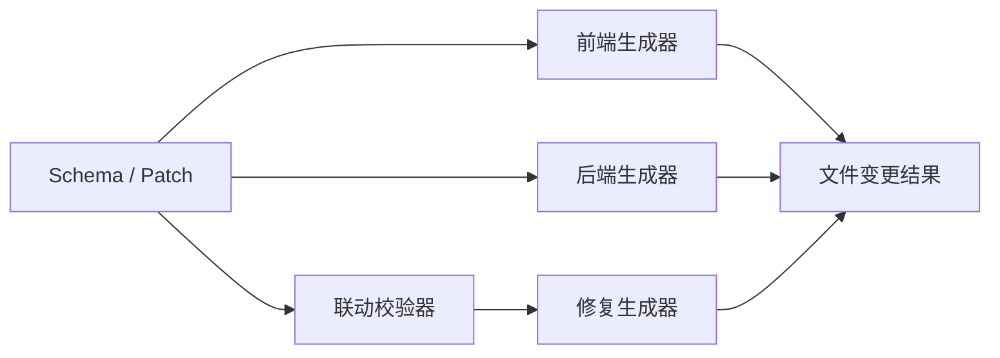

# 课堂 Vibe Coding 平台代码生成器输入输出契约

## 1. 文档目标

本契约用于定义代码生成器接收什么输入、输出什么结果、如何反馈错误与影响范围，支撑：

- 前端生成 Agent
- 后端生成 Agent
- 联动校验 Agent
- 自动修复 Agent

## 2. 设计原则

- 输入以 Schema / Patch 为主，不直接依赖自然语言
- 输出以结构化结果为主，不只返回文本
- 生成结果必须可追溯到受影响文件
- 错误结果必须可回写给教师端和学生端

## 3. 代码生成器分类

首期建议拆成四类生成器：

1. 前端生成器
2. 后端生成器
3. 联动校验器
4. 修复生成器



## 4. 通用输入契约

```json
{
  "requestId": "gen_req_001",
  "projectId": "project_stu_001",
  "schemaVersion": "0.1.0",
  "baseSnapshotId": "snap_005",
  "mode": "incremental",
  "target": "frontend",
  "schema": {},
  "patches": [],
  "workspace": {
    "root": "/workspace/project_stu_001",
    "frontendPath": "/workspace/project_stu_001/frontend",
    "backendPath": "/workspace/project_stu_001/backend"
  }
}
```

## 5. 通用输入字段说明

| 字段 | 类型 | 必填 | 说明 |
| --- | --- | --- | --- |
| requestId | string | 是 | 生成请求标识 |
| projectId | string | 是 | 项目标识 |
| schemaVersion | string | 是 | Schema 版本 |
| baseSnapshotId | string | 是 | 输入所基于的快照 |
| mode | enum | 是 | full/incremental/repair |
| target | enum | 是 | frontend/backend/linkage/fix |
| schema | object | 是 | 当前完整 Schema |
| patches | array | 否 | 本轮增量 Patch |
| workspace | object | 是 | 工作区路径信息 |

## 6. mode 说明

### full

- 用于模板初始化或首次生成
- 基于完整 Schema 生成项目骨架

### incremental

- 用于常规增量修改
- 基于 Patch 只更新受影响文件

### repair

- 用于调试修复
- 输入包含报错上下文与失败证据

## 7. 前端生成器输入契约

```json
{
  "target": "frontend",
  "frontendContext": {
    "routes": [],
    "pages": [],
    "componentTree": [],
    "theme": {},
    "events": []
  }
}
```

### 关注输入

- `ui.routes`
- `ui.pages`
- `ui.componentTree`
- `ui.theme`
- `logic.events`
- `api.queries`
- `api.mutations`

## 8. 后端生成器输入契约

```json
{
  "target": "backend",
  "backendContext": {
    "entities": [],
    "validationRules": [],
    "endpoints": [],
    "dataSourceMode": "sqlite"
  }
}
```

### 关注输入

- `data.entities`
- `data.validationRules`
- `api.endpoints`
- `runtime.backend`
- `data.dataSourceMode`

## 9. 联动校验器输入契约

```json
{
  "target": "linkage",
  "linkageContext": {
    "uiBindings": [],
    "apiBindings": [],
    "entityRefs": []
  }
}
```

### 校验重点

- 前端组件数据源是否绑定到存在的 query
- query / mutation 是否绑定到存在的 endpoint
- endpoint response 是否与 entity 定义兼容
- 页面字段展示与实体字段是否一致

## 10. 修复生成器输入契约

```json
{
  "target": "fix",
  "mode": "repair",
  "repairContext": {
    "errorType": "field_mismatch",
    "errorSummary": "前端 titleField 指向字段 title，但后端响应缺少 title",
    "relatedFiles": [
      "frontend/src/pages/Home.tsx",
      "backend/app/routes/books.py"
    ],
    "relatedPatches": [
      "patch_102"
    ]
  }
}
```

## 11. 通用输出契约

```json
{
  "requestId": "gen_req_001",
  "status": "success",
  "summary": "新增详情页、详情路由和卡片点击跳转逻辑",
  "affectedFiles": [
    {
      "path": "frontend/src/pages/Detail.tsx",
      "action": "create"
    }
  ],
  "generatedArtifacts": [],
  "diagnostics": [],
  "nextActions": []
}
```

## 12. 输出字段说明

| 字段 | 类型 | 必填 | 说明 |
| --- | --- | --- | --- |
| requestId | string | 是 | 对应输入请求 |
| status | enum | 是 | success/partial_success/failed |
| summary | string | 是 | 本轮生成摘要 |
| affectedFiles | array | 否 | 受影响文件 |
| generatedArtifacts | array | 否 | 生成产物摘要 |
| diagnostics | array | 否 | 问题列表 |
| nextActions | array | 否 | 建议后续动作 |

## 13. affectedFiles 结构

```json
{
  "path": "frontend/src/pages/Detail.tsx",
  "action": "create",
  "reason": "由 page_detail 页面生成",
  "relatedSchemaPaths": [
    "/ui/pages/1",
    "/ui/routes/1"
  ]
}
```

### action 枚举

- create
- update
- delete
- skip

## 14. diagnostics 结构

```json
{
  "level": "error",
  "code": "LINKAGE_FIELD_MISMATCH",
  "message": "前端字段 title 与接口响应字段不一致",
  "schemaPaths": [
    "/ui/componentTree/0/props/titleField",
    "/api/endpoints/0/responseRef"
  ],
  "suggestedFix": "将响应实体补充 title 字段或修改前端字段映射"
}
```

### level 枚举

- info
- warning
- error

## 15. nextActions 结构

建议用于把生成器结果反馈给编排服务。

示例：

- run_linkage_check
- start_preview
- request_manual_confirmation
- retry_backend_generation

## 16. 前端生成器输出示例

```json
{
  "status": "success",
  "summary": "生成首页与详情页组件",
  "affectedFiles": [
    {
      "path": "frontend/src/pages/Home.tsx",
      "action": "update"
    },
    {
      "path": "frontend/src/pages/Detail.tsx",
      "action": "create"
    }
  ]
}
```

## 17. 后端生成器输出示例

```json
{
  "status": "success",
  "summary": "新增留言接口与图书详情接口",
  "affectedFiles": [
    {
      "path": "backend/app/routes/books.py",
      "action": "update"
    },
    {
      "path": "backend/app/routes/messages.py",
      "action": "create"
    }
  ]
}
```

## 18. 联动校验器输出示例

```json
{
  "status": "partial_success",
  "summary": "页面结构生成成功，但发现字段绑定不一致",
  "diagnostics": [
    {
      "level": "error",
      "code": "LINKAGE_FIELD_MISMATCH",
      "message": "book_card.titleField 指向 title，但接口返回中不存在 title"
    }
  ],
  "nextActions": [
    "trigger_fix_generator"
  ]
}
```

## 19. 失败场景约定

### 19.1 输入不合法

处理：

- status 返回 `failed`
- diagnostics 中给出字段级错误
- 不生成文件变更

### 19.2 部分文件无法生成

处理：

- status 返回 `partial_success`
- 标记已生成文件与失败文件
- 输出下一步建议

### 19.3 工作区不存在

处理：

- 直接失败
- 返回工作区错误码

## 20. 文件路径约定

首期建议固定目录：

- `frontend/src/pages`
- `frontend/src/components`
- `frontend/src/routes`
- `frontend/src/store`
- `backend/app/routes`
- `backend/app/models`
- `backend/app/services`

## 21. 与编排服务的交互建议

生成器完成后，编排服务应按输出结果继续调度：

- success：进入运行或展示
- partial_success：先看 diagnostics 决定是否修复
- failed：提示学生与教师，并进入修复或人工确认

## 22. 首期不建议支持的能力

- 任意自定义代码模板输入
- 跨技术栈同时生成
- 无 Schema 的纯自然语言直接落源码
- 生成器直接修改资源配额和运行策略

## 23. 建议下一步

基于本契约，下一步最适合继续补充：

- 代码生成器字段字典
- 生成器错误码设计
- Patch 到文件变更映射表
- 联动校验规则表
