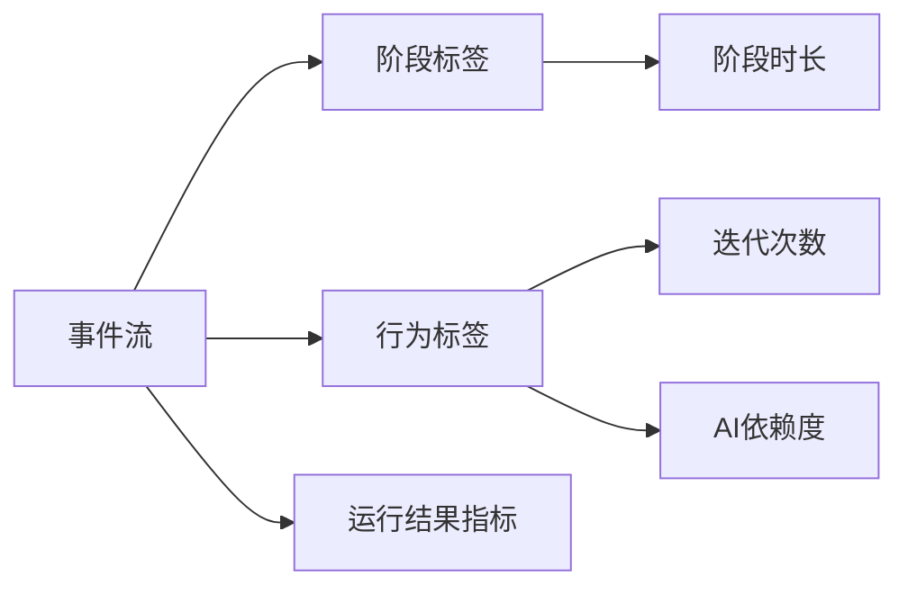

# 课堂 Vibe Coding 平台事件到指标映射表

## 1. 文档目标

本文件用于定义事件流如何映射为教学分析、自动评分与教师端可视化所需指标，确保：

- 认知分析结果可计算
- 自动评分有一致的数据口径
- 教师端图表口径统一

## 2. 设计原则

- 指标必须能从事件流稳定推导
- 指标含义应可被教师理解
- 单一指标不直接代表能力高低
- 首期优先支持可解释的统计型指标

## 3. 事件来源范围

首期建议纳入以下事件源：

- PromptSubmitted
- SchemaPatched
- CodeGenerated
- RunRequested
- RunFailed
- RunRecovered
- PreviewOpened
- ProjectSubmitted
- TeacherReviewed

## 4. 指标分类

建议分为四类：

1. 过程指标
2. 结果指标
3. 行为风险指标
4. 聚合展示指标

## 5. 过程指标映射

| 指标名 | 定义 | 主要事件来源 | 计算逻辑 |
| --- | --- | --- | --- |
| iterationCount | 总迭代次数 | SchemaPatched, CodeGenerated | 统计有效变更轮次 |
| promptCount | 对话请求次数 | PromptSubmitted | 统计提交次数 |
| runCount | 运行请求次数 | RunRequested | 统计运行总次数 |
| failedRunCount | 运行失败次数 | RunFailed | 统计失败总次数 |
| recoveredRunCount | 修复成功次数 | RunRecovered | 统计从失败走向恢复的次数 |
| previewCheckCount | 预览检查次数 | PreviewOpened | 统计查看预览次数 |
| submitCount | 提交次数 | ProjectSubmitted | 首期通常为 1，可支持重提 |

## 6. 结果指标映射

| 指标名 | 定义 | 主要事件来源 | 计算逻辑 |
| --- | --- | --- | --- |
| finalRunStatus | 最终运行状态 | RunFailed, RunRecovered | 取最后一次有效运行状态 |
| finalSubmitStatus | 最终提交状态 | ProjectSubmitted | 是否已提交 |
| autoScoreReady | 自动评分是否就绪 | TeacherReviewed 或评分任务结果 | 评分建议是否可用 |
| showcasePublished | 是否已发布公告 | TeacherReviewed 或发布事件 | 是否进入公告状态 |

## 7. 行为风险指标映射

| 指标名 | 定义 | 主要事件来源 | 计算逻辑 |
| --- | --- | --- | --- |
| aiDependencyLevel | AI 依赖程度 | PromptSubmitted, SchemaPatched, PreviewOpened | 结合请求密度与自主检查行为计算 |
| repeatedFailureLevel | 连续失败程度 | RunFailed, RunRecovered | 按连续失败段长度计算 |
| convergenceLevel | 收敛程度 | PromptSubmitted, SchemaPatched, RunRecovered | 看是否从分散修改逐步走向成功 |
| outOfScopeRisk | 跑题风险 | PromptSubmitted, SchemaPatched | 根据问题目标与变更偏移判断 |

## 8. 聚合展示指标映射

| 图表 / 看板指标 | 所需基础指标 | 说明 |
| --- | --- | --- |
| 阶段热力图 | 阶段停留时长 | 反映班级卡点 |
| 报错排行榜 | failedRunCount, errorTypeCount | 反映常见技术问题 |
| AI 依赖度分布图 | aiDependencyLevel | 反映班级依赖结构 |
| 过程分 / 结果分对照图 | processScore, resultScore | 反映过程与结果关系 |

## 9. 核心指标详细定义

## 9.1 iterationCount

### 含义

表示学生围绕项目进行有效修改的总轮次。

### 事件来源

- SchemaPatched
- CodeGenerated

### 计算建议

- 同一批次 Patch 视为 1 次迭代
- 纯查看行为不计入
- 重复无效提交可按规则合并

### 用途

- 过程评分
- 认知轨迹分析

## 9.2 recoveryRate

### 含义

表示学生从失败运行走向成功恢复的比例。

### 事件来源

- RunFailed
- RunRecovered

### 计算公式建议

```text
recoveryRate = recoveredRunCount / failedRunCount
```

### 注意

- 当 `failedRunCount = 0` 时，不直接计算百分比，可标记为 `not_applicable`

## 9.3 aiDependencyLevel

### 含义

用于辅助判断学生在过程中的 AI 使用模式。

### 事件来源

- PromptSubmitted
- PreviewOpened
- RunRequested
- SchemaPatched

### 判定建议

- Prompt 很多但检查 / 验证很少：偏高依赖
- Prompt 与验证行为平衡：中依赖
- Prompt 较少但存在自主迭代：低依赖

### 注意

- 仅作为辅助指标
- 不可直接等同于能力高低

## 9.4 outOfScopeRisk

### 含义

表示当前项目偏离教师题目边界的风险程度。

### 事件来源

- PromptSubmitted
- SchemaPatched

### 判定建议

- 对话持续偏离 questionTitle
- Patch 长期修改与题目无关模块
- 若后续重新回到题目目标，应降低风险

## 9.5 stageDuration

### 含义

表示学生在某一认知阶段停留的时间。

### 事件来源

- 阶段标签结果
- PromptSubmitted
- RunRequested
- PreviewOpened

### 用途

- 生成班级热力图
- 识别课堂普遍卡点

## 10. 事件到标签再到指标的链路

建议采用两段式映射：

1. 事件 → 标签
2. 标签 → 指标



## 11. 典型映射示例

## 11.1 调试恢复

### 事件序列

- RunFailed
- PromptSubmitted
- SchemaPatched
- RunRecovered

### 可映射标签

- debugging
- inspect_log
- apply_fix
- effective_debugging

### 可映射指标

- failedRunCount +1
- recoveredRunCount +1
- recoveryRate 更新

## 11.2 跑题后收敛

### 事件序列

- PromptSubmitted
- SchemaPatched
- PromptSubmitted
- SchemaPatched

### 可映射标签

- out_of_scope
- converge

### 可映射指标

- outOfScopeRisk 先升高再降低
- convergenceLevel 提升

## 12. 教师端图表指标口径

为了避免前后端统计口径不一致，建议统一以下口径。

### 12.1 班级阶段热力图

- 单位：分钟
- 口径：按学生在阶段内停留总时长

### 12.2 报错排行榜

- 单位：次数
- 口径：按错误类型聚合 RunFailed

### 12.3 AI 依赖度分布图

- 单位：人数
- 口径：按学生最终 aiDependencyLevel 分档

### 12.4 过程分 / 结果分对照图

- 单位：项目
- 口径：每个项目取最终教师分，若教师分缺失则回退自动建议分

## 13. 指标刷新策略

### 实时刷新

适合：

- runCount
- failedRunCount
- 当前阶段
- 资源占用

### 异步刷新

适合：

- aiDependencyLevel
- convergenceLevel
- autoScoreReady
- 聚合班级分析指标

## 14. 数据质量约束

为了保证指标可靠，建议：

- 事件必须带时间戳
- 事件必须带 sessionId / projectId
- Run 相关事件必须带 status
- Patch 相关事件必须带 source 与 affectedPaths

## 15. 首期建议上线指标

首期建议只上线这些指标：

- iterationCount
- promptCount
- runCount
- failedRunCount
- recoveredRunCount
- recoveryRate
- aiDependencyLevel
- stageDuration
- finalRunStatus
- showcasePublished

## 16. 第二阶段扩展指标

- outOfScopeRisk
- convergenceLevel
- previewValidationRate
- versionCompareCount
- rubricDimensionStability

## 17. 建议下一步

基于本映射表，下一步最适合继续补充：

- 指标字段字典
- 图表数据接口契约
- 标签到指标规则表
- 自动评分证据口径说明
