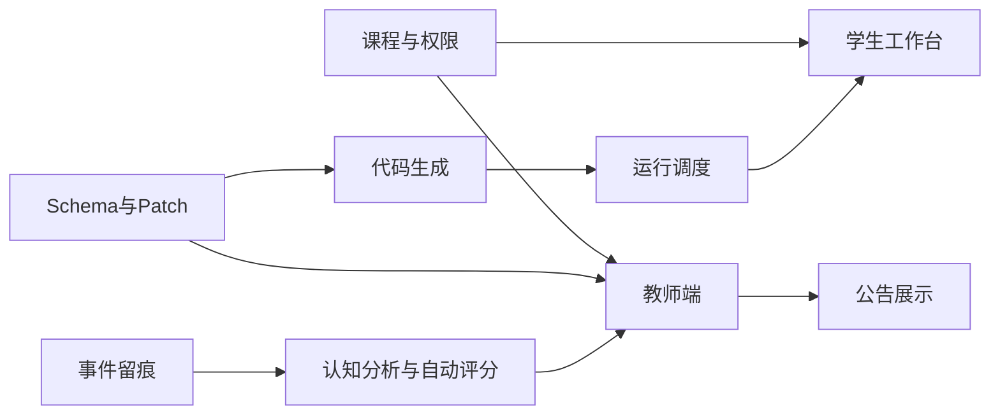

# 课堂 Vibe Coding 平台研发任务拆分清单

## 1. 文档目标

本清单用于把现有方案文档拆解成可执行的研发任务，方便：

- 需求排期
- 前后端分工
- Agent / 平台 / 测试协同
- MVP 范围控制

## 2. 拆分原则

- 先打通主闭环，再做增强项
- 按领域边界拆分模块
- 每个任务应具备可验收输出
- 优先保证教师端观察、学生端创作、运行调试三条主线

## 3. 模块划分

建议首期按 8 个模块拆分：

1. 账户与课程模块
2. 学生创作工作台模块
3. Project Schema 与 Patch 模块
4. 代码生成与联动校验模块
5. 运行调度模块
6. 教师端观察与评分模块
7. 公告展示模块
8. 事件留痕与分析模块

## 4. P0 任务清单

## 4.1 账户与课程模块

| 编号 | 任务 | 交付物 |
| --- | --- | --- |
| P0-A1 | 实现课程、班级、课堂、主题、问题基础模型 | 后端表结构与接口 |
| P0-A2 | 实现学生、教师、管理员登录态与角色鉴权 | 认证中间件与角色控制 |
| P0-A3 | 实现教师端课程总览基础数据接口 | overview 接口 |

## 4.2 学生创作工作台模块

| 编号 | 任务 | 交付物 |
| --- | --- | --- |
| P0-B1 | 实现学生工作台基础页面框架 | 前端工作台壳层 |
| P0-B2 | 实现对话区与配置面板区联动 | 页面交互骨架 |
| P0-B3 | 实现预览区与日志区基础状态展示 | 运行结果面板 |
| P0-B4 | 实现提交结果与查看评分入口 | 提交与结果页 |

## 4.3 Schema 与 Patch 模块

| 编号 | 任务 | 交付物 |
| --- | --- | --- |
| P0-C1 | 定义 Schema 类型与字段校验器 | Schema 类型文件与校验逻辑 |
| P0-C2 | 实现 Patch 存储与应用服务 | Patch 服务 |
| P0-C3 | 实现 Schema 快照机制 | snapshot 存储与回滚能力 |

## 4.4 代码生成与联动校验模块

| 编号 | 任务 | 交付物 |
| --- | --- | --- |
| P0-D1 | 实现前端生成器 MVP | 页面 / 组件 / 路由生成 |
| P0-D2 | 实现后端生成器 MVP | 接口 / 模型 / 服务生成 |
| P0-D3 | 实现联动校验器 MVP | 前后端一致性校验 |
| P0-D4 | 实现生成诊断结构化输出 | diagnostics 结果结构 |

## 4.5 运行调度模块

| 编号 | 任务 | 交付物 |
| --- | --- | --- |
| P0-E1 | 实现 Docker 容器池分配能力 | 沙箱分配服务 |
| P0-E2 | 实现项目运行、停止、日志采集 | 运行调度接口 |
| P0-E3 | 实现预览地址生成与状态管理 | preview 服务 |

## 4.6 教师端观察与评分模块

| 编号 | 任务 | 交付物 |
| --- | --- | --- |
| P0-F1 | 实现教师端项目列表页 | 项目列表页面 |
| P0-F2 | 实现学生详情页聚合接口 | 聚合详情接口 |
| P0-F3 | 实现 Rubric 配置基础能力 | Rubric 接口与页面 |
| P0-F4 | 实现教师评分提交能力 | teacher score 接口与表单 |

## 4.7 公告展示模块

| 编号 | 任务 | 交付物 |
| --- | --- | --- |
| P0-G1 | 实现优秀作品候选列表 | 教师公告候选页 |
| P0-G2 | 实现限时访问结果页生成 | result url 能力 |
| P0-G3 | 实现公告发布与下架能力 | showcase 接口 |

## 4.8 事件留痕与分析模块

| 编号 | 任务 | 交付物 |
| --- | --- | --- |
| P0-H1 | 实现对话、Patch、运行事件写入 | 事件写入服务 |
| P0-H2 | 实现认知标签基础计算 | 标签计算逻辑 |
| P0-H3 | 实现自动评分异步任务 MVP | auto score 队列任务 |

## 5. P1 任务清单

| 编号 | 任务 | 交付物 |
| --- | --- | --- |
| P1-01 | 实现班级热力图与报错排行榜 | 教师端图表 |
| P1-02 | 实现自动评分重算 | 重算接口与任务 |
| P1-03 | 实现更细粒度资源配额管理 | 课堂资源管理增强 |
| P1-04 | 实现公告有效期续期能力 | 展示治理增强 |
| P1-05 | 实现配置面板字段级错误提示 | 前端体验增强 |
| P1-06 | 实现教学模板库 | 模板管理能力 |

## 6. P2 任务清单

| 编号 | 任务 | 交付物 |
| --- | --- | --- |
| P2-01 | 实现技术栈白名单切换 | 多 profile 管理 |
| P2-02 | 实现干预组 / 限制组能力 | 权限增强 |
| P2-03 | 实现归档库联动查询 | 历史查询能力 |
| P2-04 | 实现 Kubernetes 迁移能力 | 平台扩展 |
| P2-05 | 实现多人协作基础能力 | 协作增强 |

## 7. 建议团队分工

## 7.1 后端 / 平台

- 课程与课堂域接口
- Schema / Patch 服务
- 运行调度
- 自动评分任务
- 公告与权限接口

## 7.2 前端

- 学生工作台
- 教师端页面
- 配置面板
- 图表与时间线
- 错误提示与空态

## 7.3 Agent / AI 能力

- 对话解析
- 前端生成器
- 后端生成器
- 联动校验器
- 修复生成器
- 认知标签与自动评分规则

## 7.4 测试 / QA

- 教师端联调
- 学生端主流程回归
- 状态码验证
- 权限验证
- 公告访问验证

## 8. 验收分组建议

## 8.1 学生主流程验收

- 进入课堂
- 选择问题
- 对话 / 配置修改
- 运行预览
- 提交项目
- 查看评分

## 8.2 教师主流程验收

- 查看班级总览
- 查看学生项目
- 查看认知过程
- 评分
- 发布优秀作品

## 8.3 平台运行验收

- 容器池分配
- 运行日志采集
- 自动评分任务执行
- 公告结果页限时访问

## 9. 依赖关系建议

## 10. 研发节奏建议

建议按 4 个节奏推进：

1. 基础数据与权限
2. 学生创作闭环
3. 教师评分与公告闭环
4. 自动评分与认知分析增强

## 11. 风险提醒

首期最容易拖慢进度的点：

- 试图一开始做太灵活的技术栈
- 试图开放绕过 Schema 的直接代码编辑
- 试图把认知分析做成复杂 AI 模型
- 试图同时做学生端、教师端、管理员端所有增强能力

## 12. 建议下一步

基于本清单，下一步最适合继续补充：

- Sprint 任务排期表
- 模块负责人建议
- 验收标准清单
- 开发里程碑看板模板
