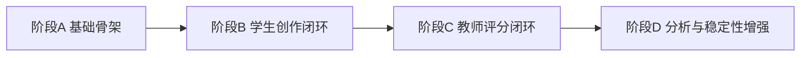

# 课堂 Vibe Coding 平台 MVP 实施路线图

## 1. 文档目标

本路线图用于描述平台从方案阶段进入 MVP 实施阶段的推进顺序、阶段目标、里程碑和出口标准，帮助：

- 控制范围
- 统一研发节奏
- 让产品、研发、测试对齐优先级

## 2. 路线图原则

- 先打通主链路，再做分析增强
- 先保证课堂能用，再保证体验更好
- 先支撑 100 人课堂，再考虑平台化扩展
- 每阶段都必须能形成可演示结果

## 3. MVP 主链路定义

首期 MVP 必须打通以下闭环：

1. 教师创建课堂、主题、问题
2. 学生进入课堂并创建个人项目
3. 学生通过对话或配置修改项目
4. 平台基于 Schema / Patch 生成前后端代码
5. 平台分配沙箱并运行预览
6. 学生提交结果
7. 教师查看过程、评分并发布优秀作品

## 4. 路线图阶段划分

建议拆成 4 个阶段：

1. 阶段 A：基础骨架
2. 阶段 B：学生创作闭环
3. 阶段 C：教师评分闭环
4. 阶段 D：分析与稳定性增强

## 5. 阶段 A：基础骨架

## 5.1 阶段目标

完成平台最小骨架，保证课程、角色、项目、Schema 能跑通。

## 5.2 关键产出

- 登录与角色鉴权
- 课程 / 班级 / 课堂 / 主题 / 问题模型
- 学生项目主表
- Project Schema 与 Patch 基础能力
- 教师端课程总览基础接口

## 5.3 出口标准

- 不同角色可登录
- 教师可创建课堂与问题
- 学生可创建个人项目
- Schema 快照可正常保存

## 6. 阶段 B：学生创作闭环

## 6.1 阶段目标

完成学生从创作到运行再到提交的主流程。

## 6.2 关键产出

- 学生工作台页面
- 对话区与配置面板
- 前端生成器 MVP
- 后端生成器 MVP
- 联动校验器 MVP
- Docker 容器池运行能力
- 运行预览与日志展示
- 提交项目能力

## 6.3 出口标准

- 学生可以在课堂内完成一次完整原型搭建
- 平台可对前后端做联动生成
- 运行环境可稳定启动
- 提交结果可被教师端看到

## 7. 阶段 C：教师评分闭环

## 7.1 阶段目标

完成教师查看学生项目、评分与公告发布的闭环。

## 7.2 关键产出

- 教师项目列表页
- 学生详情页
- Rubric 配置页
- 教师评分接口与表单
- 公告候选页与发布能力
- 限时结果页访问

## 7.3 出口标准

- 教师可查看学生过程与结果
- 教师可完成评分
- 教师可发布优秀作品到公告区

## 8. 阶段 D：分析与稳定性增强

## 8.1 阶段目标

补上自动评分、认知分析、可视化和高并发稳定性增强。

## 8.2 关键产出

- 自动评分异步任务
- 认知标签计算
- 班级热力图
- 报错排行榜
- AI 依赖度分布图
- 状态码提示文案
- 联调用例与测试回归

## 8.3 出口标准

- 自动评分建议可在提交后生成
- 教师端可看到基础认知分析图表
- 课堂 100 人级并发具备可用性

## 9. 阶段依赖关系

## 10. 推荐里程碑

## 里程碑 M1

- 课程、班级、课堂、主题、问题建模完成
- 角色与权限骨架完成
- Schema / Patch 基础能力完成

## 里程碑 M2

- 学生工作台可用
- 生成器 MVP 可用
- Docker 运行预览可用

## 里程碑 M3

- 教师端项目列表、详情、评分可用
- 公告发布与限时访问可用

## 里程碑 M4

- 自动评分建议可用
- 认知分析图表可用
- 教师端主流程稳定

## 11. 各阶段建议参与角色

| 阶段 | 产品 | 前端 | 后端 | 平台 | AI / Agent | 测试 |
| --- | --- | --- | --- | --- | --- | --- |
| A | 高参与 | 中 | 高 | 中 | 中 | 低 |
| B | 高参与 | 高 | 高 | 高 | 高 | 中 |
| C | 高参与 | 高 | 高 | 中 | 中 | 高 |
| D | 中 | 中 | 高 | 高 | 高 | 高 |

## 12. 风险控制建议

### 阶段 A 风险

- 课程与课堂模型过度复杂
- 角色边界不清导致后续反复改

### 阶段 B 风险

- 代码生成器过早追求复杂度
- 容器启动时间过长影响体验

### 阶段 C 风险

- 教师端聚合接口过重
- 评分模型与页面交互不一致

### 阶段 D 风险

- 自动评分精度预期过高
- 图表指标口径不统一

## 13. 不建议在 MVP 首期强行纳入

- Kubernetes 化
- 技术栈白名单切换
- 多人协作
- 干预组 / 限制组
- 跨课堂分析

## 14. 上线前建议验收项

- 学生主流程闭环
- 教师主流程闭环
- 公告区可访问
- 自动评分建议可生成
- 关键状态码与权限场景可复现
- 100 人课堂压测达到可接受水平

## 15. 建议下一步

基于本路线图，下一步最适合继续补充：

- Sprint 计划表
- 上线验收清单
- 压测计划草案
- 里程碑风险台账
