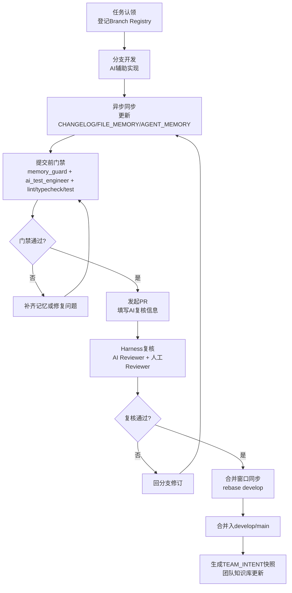

# 团队执行版 SOP：AI 协同开发统一流程

## 1. 一页流程图



## 2. 每日操作清单

## 2.1 开工前（每人）

- 拉取最新 `develop`
- 在 `BRANCH_REGISTRY.md` 登记今日分支与目标
- 确认是否涉及热点文件或核心接口

## 2.2 开发中（每次关键变更）

- 更新 `AGENT_MEMORY.md` 记录 AI 决策和不确定项
- 若改动接口/Schema/核心文件，更新 `FILE_MEMORY.md`
- 在 `CHANGELOG.md` 追加异步播报记录

## 2.3 提交前（硬门禁）

- 执行记忆门禁：`python scripts/ai_collab/memory_guard.py --staged-only`
- 执行测试工程门禁：`python scripts/ai_collab/ai_test_engineer_check.py --staged-only`
- 运行 lint / typecheck / test
- 检查 PR 模板是否完整、AI 复核字段是否填写
- 本地 `pre-push` 自动执行上述两项门禁

## 2.4 合并窗口（同步）

- 先 `rebase develop`
- 处理冲突并记录同步结论
- 合并后执行 `python scripts/ai_collab/build_team_intent.py`
- 合并后执行 `python scripts/ai_collab/snapshot_hotspot_history.py`
- 每周固定执行 `python scripts/ai_collab/build_weekly_metrics.py`
- 每周固定执行 `python scripts/ai_collab/conflict_risk_score.py`
- 每周固定执行 `python scripts/ai_collab/build_weekly_review.py`
- 把 `TEAM_INTENT.md` 作为下一轮 AI 默认上下文输入

## 3. Harness Engineering 角色分工

## 3.1 角色定义

- **AI Builder**：生成与修改代码
- **AI Reviewer**：独立复核设计一致性、风险与可维护性
- **AI Test Engineer**：补充测试用例、检查正确性与回归风险
- **Human Owner**：最终合并决策与风险兜底

## 3.2 复核责任矩阵

| 事项 | AI Builder | AI Reviewer | AI Test Engineer | Human Owner |
| --- | --- | --- | --- | --- |
| 功能实现 | R | C | C | A |
| 设计一致性 | C | R | C | A |
| 测试正确性 | C | C | R | A |
| 合并决策 | C | C | C | A |

## 4. 团队知识库机制

每次合并后，必须更新以下团队知识资产：

- `CHANGELOG.md`：时间线事实
- `FILE_MEMORY.md`：文件级冲突与影响
- `AGENT_MEMORY.md`：AI会话决策与不确定项
- `TEAM_INTENT.md`：当前开发意图快照

知识库用途：

- 让不同 AI 工具共享同一上下文
- 让复核 AI 获取“团队当前目标”而非孤立片段
- 让新成员快速理解近期变更与风险点

## 5. 试运行节奏（建议）

- 每日两次合并窗口
- 每晚自动生成一次 `TEAM_INTENT.md`
- 每周一次流程复盘会议
- 每两周更新一次 v0.x 协同规范版本

## 6. 最小执行命令集

```bash
python scripts/ai_collab/memory_guard.py --staged-only
python scripts/ai_collab/ai_test_engineer_check.py --staged-only
python scripts/ai_collab/build_team_intent.py
python scripts/ai_collab/snapshot_hotspot_history.py
python scripts/ai_collab/build_weekly_metrics.py
python scripts/ai_collab/conflict_risk_score.py
python scripts/ai_collab/build_weekly_review.py
```
